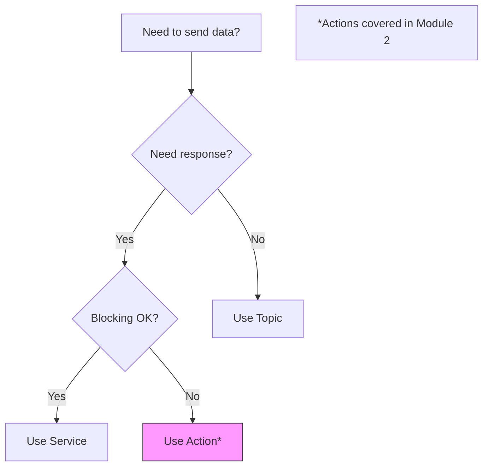

# ROS 2 Service Pattern Skill

**Purpose**: Generate accurate, educational ROS 2 service server and client code following official ROS 2 Humble patterns for the Physical AI textbook.

## When to Use

- Creating lessons in Chapter 5 (Communication Mastery)
- Writing service-based exercises for robot commands
- Generating worked examples that demonstrate request/response patterns
- Teaching when to use services vs topics

## Live Documentation Access

**CRITICAL**: Before generating any code, fetch current ROS 2 documentation using Context7 MCP:

```
Tool: mcp__context7__resolve-library-id
libraryName: "ros2 rclpy services"

Then:
Tool: mcp__context7__get-library-docs
context7CompatibleLibraryID: [resolved ID]
topic: "service server client"
```

This ensures code matches current ROS 2 Humble API.

## Code Generation Principles

### Service Server Pattern (Canonical)

```python
from example_interfaces.srv import AddTwoInts

import rclpy
from rclpy.node import Node

class MinimalService(Node):
    def __init__(self):
        super().__init__('minimal_service')
        self.srv = self.create_service(
            AddTwoInts,
            'add_two_ints',
            self.add_two_ints_callback)

    def add_two_ints_callback(self, request, response):
        response.sum = request.a + request.b
        self.get_logger().info(f'Incoming request: a={request.a} b={request.b}')
        return response

def main():
    rclpy.init()
    minimal_service = MinimalService()
    rclpy.spin(minimal_service)
    rclpy.shutdown()

if __name__ == '__main__':
    main()
```

### Service Client Pattern (Canonical - Async)

```python
import sys
from example_interfaces.srv import AddTwoInts
import rclpy
from rclpy.node import Node

class MinimalClientAsync(Node):
    def __init__(self):
        super().__init__('minimal_client_async')
        self.cli = self.create_client(AddTwoInts, 'add_two_ints')
        while not self.cli.wait_for_service(timeout_sec=1.0):
            self.get_logger().info('service not available, waiting again...')
        self.req = AddTwoInts.Request()

    def send_request(self, a, b):
        self.req.a = a
        self.req.b = b
        self.future = self.cli.call_async(self.req)
        rclpy.spin_until_future_complete(self, self.future)
        return self.future.result()

def main():
    rclpy.init()
    minimal_client = MinimalClientAsync()
    response = minimal_client.send_request(int(sys.argv[1]), int(sys.argv[2]))
    minimal_client.get_logger().info(
        f'Result: {sys.argv[1]} + {sys.argv[2]} = {response.sum}')
    minimal_client.destroy_node()
    rclpy.shutdown()

if __name__ == '__main__':
    main()
```

## Topics vs Services Decision Framework

**Use Topics When:**
- Continuous data streams (sensor readings, odometry)
- One-to-many communication (multiple subscribers)
- Fire-and-forget (no response needed)
- High frequency updates (>10 Hz)

**Use Services When:**
- Request/response needed (commands with confirmation)
- One-to-one communication
- Synchronous operation required
- Infrequent calls (configuration, mode changes)

### Decision Diagram (Mermaid)



## Educational Requirements

### Layer 1 (Manual Foundation)
- Explain service lifecycle (advertise → spin → handle requests)
- Diagram request/response flow
- Contrast with pub/sub (synchronous vs asynchronous)

### Layer 2 (AI Collaboration)
- Prompt templates for creating new services
- Error handling patterns with AI assistance
- Timeout and retry strategies (Three Roles INVISIBLE)

### Layer 3 (Intelligence Design)
- Service composition patterns
- Error recovery strategies
- Links to ros2-custom-interfaces for custom service types

## Hardware Tier Compatibility

All code MUST work on:
- **Tier 1**: Cloud ROS 2 (TheConstruct) or simulation
- **Tier 2+**: Local ROS 2 Humble installation

## Common Mistakes to Prevent

1. **Blocking in callback**: Service callbacks should be fast; heavy processing blocks node
2. **Missing wait_for_service()**: Client calls fail if service not available
3. **Forgetting async pattern**: Use call_async() not call() for non-blocking
4. **No error handling**: Always handle service unavailable gracefully

## Integration with Other Skills

- **ros2-custom-interfaces**: When custom service types (.srv) needed
- **ros2-publisher-subscriber**: For hybrid patterns (service + topic)
- **ros2-launch-system**: When launching service nodes together

## Authoritative Source

All patterns verified against: https://docs.ros.org/en/humble/Tutorials/Beginner-Client-Libraries/Writing-A-Simple-Py-Service-And-Client.html
