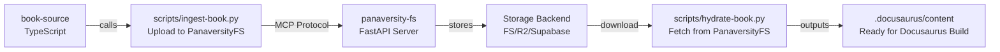

# Python Project Nx Integration Strategy

**Project**: `panaversity-fs`
**Type**: FastAPI MCP Server (Python 3.13)
**Status**: Production-Ready
**Integration Date**: 2025-12-15

---

## Executive Summary

This document specifies the optimal Nx integration approach for `panaversity-fs`, a production Python MCP server with 301 tests and complex orchestration requirements.

**Key Findings:**
- **Option Recommended**: Option B (Makefile Wrapper) with Option C (Native Plugin) as future-forward path
- **Rationale**: Minimal disruption, leverages existing build system, maintains uv as native package manager
- **Integration Impact**: Zero changes to Python source, pure Nx configuration
- **Cross-Project Impact**: Enables CI/CD affected-only testing with TypeScript book projects

---

## Phase 1: Project Deep Dive

### 1.1 Project Configuration

```
pyproject.toml (1.5KB)
├── name: panaversity-fs v0.1.0
├── requires-python: >=3.13 (actual: 3.13 via .python-version)
├── build-backend: hatchling
├── 28 production dependencies
├── 8 development dependencies
└── pytest configuration (asyncio_mode: auto)
```

### 1.2 Dependency Breakdown

| Category | Count | Purpose |
|----------|-------|---------|
| **Async Runtime** | 5 | aiofiles, aiosqlite, asyncpg, httpx, greenlet |
| **Database** | 2 | SQLAlchemy 2.0, Alembic migrations |
| **ML/MCP** | 2 | mcp>=1.22.0, hypothesis |
| **Storage** | 1 | opendal>=0.46.0 (multi-backend abstraction) |
| **Auth/Security** | 3 | pyjwt, cryptography, python-dotenv |
| **Config** | 2 | pydantic, pydantic-settings |
| **Utilities** | 10 | python-magic, pyyaml, prometheus-client, etc. |

**Dev Dependencies**:
- pytest (8.0+), pytest-asyncio, pytest-cov, pytest-timeout
- black (24.0+), ruff (0.1+), mypy (1.8+)

### 1.3 Source Structure

```
src/panaversity_fs/ (17 modules, ~2K LOC)
├── server.py                  # Entry point
├── app.py                     # FastAPI app config
├── config.py                  # Pydantic Settings
├── models.py                  # Request/response Pydantic models
├── storage.py                 # OpenDAL wrapper
├── path_utils.py              # Path validation (FR-007/008/009)
├── auth.py                    # JWT + Better-Auth integration
├── audit.py                   # Hash-chain audit logging
├── metrics.py                 # Prometheus instrumentation
├── database/
│   ├── connection.py          # SQLAlchemy session factory
│   ├── models.py              # ORM models
│   └── migrations/            # Alembic
└── tools/                     # 12 MCP tools
    ├── content.py
    ├── assets.py
    ├── search.py
    ├── registry.py
    ├── bulk.py
    ├── validate.py
    ├── delta.py
    └── ...
```

### 1.4 Test Structure (35 Test Files, 8,837 LOC, 301 Tests Total)

| Category | Files | Tests | Purpose |
|----------|-------|-------|---------|
| **unit/** | 12 | ~150 | Component isolation (auth, tools, audit, metrics, paths) |
| **integration/** | 3 | ~80 | Workflow tests (conflicts, content, streaming) |
| **property/** | 5 | ~50 | Hypothesis invariant tests (R1-R7 requirements) |
| **performance/** | 2 | ~15 | Latency/throughput benchmarks |
| **edge_cases/** | 1 | ~5 | Production structure validation |
| **e2e/** | 1 | ~2 | Complete book workflow |
| **scripts/** | 2 | ~2 | Hydration/ingestion scripts |

**Test Categories by Concern**:
- **Path Validation**: test_path_utils.py (10+ test cases)
- **Audit Chain**: test_audit_chain.py (hash integrity invariants)
- **Content Tools**: test_content_tools.py (CRUD operations)
- **Overlay Logic**: test_overlay_content.py (user personalization)
- **Schema Compliance**: test_invariant_r1_schema.py (FR-001 compliance)
- **Streaming**: test_streaming_archive.py (ZIP generation performance)

---

## Phase 2: Current Build/Test/Deploy

### 2.1 Installation

```bash
# Using uv (preferred, pinned in uv.lock)
cd panaversity-fs && uv sync

# Or via pip
pip install -e ".[dev]"
```

**Package Manager Decision**:
- Primary: `uv` (26x faster, lock-file based, Python 3.13 native)
- Fallback: `pip` + `setup.py` (for CI where uv unavailable)

### 2.2 Test Execution

```bash
# All tests (pytest configuration in pyproject.toml)
python -m pytest tests/ -v

# By category (from Makefile targets)
python -m pytest tests/unit/ -v           # Unit tests
python -m pytest tests/integration/ -v    # Integration tests
python -m pytest tests/property/ -v       # Property tests
python -m pytest tests/performance/ -v    # Performance benchmarks
python -m pytest tests/e2e/ -v            # End-to-end
python -m pytest tests/scripts/ -v        # Script tests
python -m pytest tests/edge_cases/ -v     # Edge cases
```

**Coverage**:
```bash
pytest tests/ --cov=src/panaversity_fs --cov-report=term --cov-report=html
```

### 2.3 Linting & Type Checking

```bash
# Linting (from Makefile)
python -m ruff check .

# Formatting
python -m ruff format .

# Type checking
python -m mypy src/

# Combined (recommended)
ruff check . && ruff format . && mypy src/ && pytest tests/ -q
```

### 2.4 Development Server

```bash
# FastAPI dev server with auto-reload
python -m uvicorn src.panaversity_fs.server:app --reload --port 8000

# Or via Makefile
make dev-server  # PANAVERSITY_MCP_URL=http://localhost:8000
```

### 2.5 Build for Production

```dockerfile
# Two-stage Docker build (Dockerfile.prod)
Stage 1: uv pip compile pyproject.toml -> requirements.txt
Stage 2: pip install -r requirements.txt + copy src/

# Health check: POST /mcp with MCP tools/list
HEALTHCHECK: Python urllib.request (MCP availability check)

# Run: uvicorn with 2 workers
CMD: uvicorn panaversity_fs.server:streamable_http_app --port 8000 --workers 2
```

### 2.6 Deployment

**Current**: Docker container
**Target**: Cloud Run (GCP) or similar serverless
**Entry Point**: `panaversity_fs.server:streamable_http_app` (FastAPI)

---

## Phase 3: Nx Integration Options Analysis

### Option A: Custom Executors (nx:run-commands)

**Approach**: Wrap each Makefile target in Nx executor

```json
{
  "name": "panaversity-fs",
  "projectType": "application",
  "sourceRoot": "panaversity-fs/src",
  "targets": {
    "install": {
      "executor": "nx:run-commands",
      "options": {
        "command": "cd panaversity-fs && uv sync",
        "cwd": "."
      }
    },
    "test": {
      "executor": "nx:run-commands",
      "options": {
        "command": "cd panaversity-fs && python -m pytest tests/ -v",
        "cwd": "."
      },
      "configurations": {
        "unit": {
          "command": "cd panaversity-fs && python -m pytest tests/unit/ -v"
        },
        "integration": {
          "command": "cd panaversity-fs && python -m pytest tests/integration/ -v"
        }
      }
    },
    "lint": {
      "executor": "nx:run-commands",
      "options": {
        "command": "cd panaversity-fs && ruff check ."
      }
    },
    "format": {
      "executor": "nx:run-commands",
      "options": {
        "command": "cd panaversity-fs && ruff format ."
      }
    },
    "typecheck": {
      "executor": "nx:run-commands",
      "options": {
        "command": "cd panaversity-fs && mypy src/"
      }
    },
    "dev": {
      "executor": "nx:run-commands",
      "options": {
        "command": "cd panaversity-fs && python -m uvicorn src.panaversity_fs.server:app --reload --port 8000"
      }
    }
  }
}
```

**Pros**:
- Explicit, clear, no magic
- Full Nx ecosystem access (affected, cache, etc.)
- Easy to parallelize

**Cons**:
- Duplicates Makefile logic
- Harder to maintain in sync
- Python environment must be pre-configured in CI

---

### Option B: Makefile Wrapper (Recommended)

**Approach**: Nx targets delegate to existing Makefile

```json
{
  "name": "panaversity-fs",
  "projectType": "application",
  "sourceRoot": "panaversity-fs/src",
  "targets": {
    "install": {
      "executor": "nx:run-commands",
      "options": {
        "command": "make -C panaversity-fs setup"
      }
    },
    "test": {
      "executor": "nx:run-commands",
      "options": {
        "command": "make -C panaversity-fs test",
        "cwd": "."
      },
      "configurations": {
        "unit": {
          "command": "make -C panaversity-fs test-unit"
        },
        "integration": {
          "command": "make -C panaversity-fs test-integration"
        },
        "property": {
          "command": "make -C panaversity-fs test-property"
        },
        "performance": {
          "command": "make -C panaversity-fs test-performance"
        }
      }
    },
    "lint": {
      "executor": "nx:run-commands",
      "options": {
        "command": "make -C panaversity-fs lint"
      }
    },
    "format": {
      "executor": "nx:run-commands",
      "options": {
        "command": "make -C panaversity-fs format"
      }
    },
    "typecheck": {
      "executor": "nx:run-commands",
      "options": {
        "command": "cd panaversity-fs && python -m mypy src/"
      }
    },
    "dev": {
      "executor": "nx:run-commands",
      "options": {
        "command": "make -C panaversity-fs dev-server"
      }
    },
    "build": {
      "executor": "nx:run-commands",
      "options": {
        "command": "make -C panaversity-fs build"
      }
    },
    "clean": {
      "executor": "nx:run-commands",
      "options": {
        "command": "make -C panaversity-fs clean"
      }
    }
  }
}
```

**Pros**:
- Single source of truth (Makefile)
- Zero Python code changes required
- Easy to migrate existing workflows
- Developers already know Makefile targets
- Adds Nx affected-only CI without duplicating logic

**Cons**:
- Makefile must exist (already does)
- Less fine-grained control from Nx perspective
- Nx doesn't understand Python dependencies directly

---

### Option C: @nx/python Plugin (Future-Forward)

**Status**: Experimental (Nx 18+)
**Maturity**: Not production-ready for this use case yet

```json
{
  "name": "panaversity-fs",
  "projectType": "application",
  "targets": {
    "test": {
      "executor": "@nx/python:pytest",
      "options": {
        "testPathPattern": "tests",
        "jestConfig": "panaversity-fs/pytest.ini"
      }
    }
  }
}
```

**Status**: Requires `@nx/python` plugin (requires evaluation)

---

## Phase 4: Caching Strategy

### 4.1 Cache Inputs (What affects test results?)

| Input | Hash Impact | Example |
|-------|------------|---------|
| **pyproject.toml** | HIGH | Dependency changes, version bumps |
| **uv.lock** | HIGH | Any dependency update |
| **src/** | HIGH | Source code changes |
| **tests/** | HIGH | Test file changes |
| **.python-version** | HIGH | Python runtime version (3.13) |
| **pytest.ini** | MEDIUM | Test config changes (asyncio_mode) |
| **.env** | MEDIUM | Environment variable changes |
| **Database state** | LOW | Tests reset database each run |
| **.venv/** | NONE | Exclude from cache (rebuilt from lock) |

### 4.2 Nx Cache Configuration

```json
{
  "targetDefaults": {
    "test": {
      "inputs": [
        "{projectRoot}/src/**/*.py",
        "{projectRoot}/tests/**/*.py",
        "{projectRoot}/pyproject.toml",
        "{projectRoot}/uv.lock",
        "{projectRoot}/.python-version",
        "{projectRoot}/pytest.ini"
      ],
      "outputs": [
        "{projectRoot}/.pytest_cache",
        "{projectRoot}/htmlcov"
      ]
    },
    "lint": {
      "inputs": [
        "{projectRoot}/src/**/*.py",
        "{projectRoot}/tests/**/*.py",
        "{projectRoot}/pyproject.toml"
      ]
    },
    "typecheck": {
      "inputs": [
        "{projectRoot}/src/**/*.py",
        "{projectRoot}/pyproject.toml"
      ]
    }
  }
}
```

### 4.3 .venv Handling

**Recommendation**: Exclude from caching

```gitignore
# .gitignore
panaversity-fs/.venv/
panaversity-fs/__pycache__/
panaversity-fs/*.pyc
panaversity-fs/.pytest_cache/
```

**Rationale**:
- `.venv` is platform-specific (rebuilds differ by OS)
- `uv.lock` is the source of truth
- CI rebuilds venv fresh each time (faster than cache transfer)
- Local development has persistent `.venv` anyway

### 4.4 Nx Cloud Remote Cache Configuration

For CI environments (GitHub Actions, etc.):

```yaml
# .github/workflows/nx-cache.yml
- name: Setup Nx Cache
  uses: nrwl/nx-set-shas@v4
  with:
    main-branch-name: main
    error-on-cache-miss: false

- name: Restore .venv from cache
  uses: actions/cache@v4
  with:
    path: panaversity-fs/.venv
    key: ${{ runner.os }}-venv-${{ hashFiles('panaversity-fs/uv.lock') }}
    restore-keys: |
      ${{ runner.os }}-venv-
```

---

## Phase 5: Cross-Project Integration Points

### 5.1 book-source ↔ panaversity-fs Integration

```
apps/learn-app/ (TypeScript, Docusaurus 3.9.2)
├── package.json
├── scripts/build.sh           ← Invokes Python scripts
└── ...

panaversity-fs/ (Python 3.13, FastAPI)
├── pyproject.toml
├── scripts/
│   ├── hydrate-book.py        ← Called by apps/learn-app/build.sh
│   ├── ingest-book.py
│   └── common/                ← Shared utilities
└── Makefile
```

### 5.2 Build-Time Integration



### 5.3 Runtime Integration

```
AI Agents (Claude Code)
    ↓ MCP calls
PanaversityFS MCP Server (Python)
    ↓ Tools (12 total)
Storage + Database + Audit Trail
```

### 5.4 Nx Workspace Structure After Integration

```
workspace root/
├── nx.json (workspace config with python settings)
├── pnpm-workspace.yaml (or package.json, pnpm-lock.yaml)
├── apps/learn-app/ (Nx project: website)
│   └── project.json
├── panaversity-fs/ (Nx project: panaversity-fs) ← NEW
│   ├── project.json ← NEW
│   ├── pyproject.toml (unchanged)
│   ├── uv.lock (unchanged)
│   └── Makefile (unchanged)
└── ...other projects
```

### 5.5 Affected-Only Testing Strategy

After integration with Option B:

```bash
# Change only Python source
git diff main -- panaversity-fs/src/...
nx affected -t test
# Runs: panaversity-fs:test + any projects that depend on it

# Change only Docusaurus
git diff main -- apps/learn-app/docs/...
nx affected -t test
# Runs: website:build (no Python tests)

# Change hydration script
git diff main -- panaversity-fs/scripts/hydrate-book.py
nx affected -t test
# Runs: panaversity-fs:test (Python) + website:build (TypeScript)
```

---

## Phase 6: Recommended Configuration

### 6.1 Complete project.json for panaversity-fs

```json
{
  "$schema": "../../node_modules/nx/schemas/project-schema.json",
  "name": "panaversity-fs",
  "projectType": "application",
  "sourceRoot": "panaversity-fs/src",
  "testRoot": "panaversity-fs/tests",
  "tags": ["scope:backend", "type:mcp-server"],
  "targets": {
    "install": {
      "executor": "nx:run-commands",
      "options": {
        "command": "make -C panaversity-fs setup",
        "cwd": "."
      },
      "description": "Install Python dependencies via uv"
    },
    "test": {
      "executor": "nx:run-commands",
      "options": {
        "command": "make -C panaversity-fs test",
        "cwd": "."
      },
      "configurations": {
        "unit": {
          "command": "make -C panaversity-fs test-unit"
        },
        "integration": {
          "command": "make -C panaversity-fs test-integration"
        },
        "property": {
          "command": "make -C panaversity-fs test-property"
        },
        "performance": {
          "command": "make -C panaversity-fs test-performance"
        },
        "e2e": {
          "command": "make -C panaversity-fs test-e2e"
        },
        "all": {
          "command": "make -C panaversity-fs test && make -C panaversity-fs test-performance"
        }
      },
      "description": "Run tests (all, unit, integration, property, performance, e2e)"
    },
    "test:coverage": {
      "executor": "nx:run-commands",
      "options": {
        "command": "cd panaversity-fs && python -m pytest tests/ --cov=src/panaversity_fs --cov-report=term --cov-report=html",
        "cwd": "."
      },
      "description": "Run tests with coverage report"
    },
    "lint": {
      "executor": "nx:run-commands",
      "options": {
        "command": "make -C panaversity-fs lint",
        "cwd": "."
      },
      "description": "Lint Python code with ruff"
    },
    "format": {
      "executor": "nx:run-commands",
      "options": {
        "command": "make -C panaversity-fs format",
        "cwd": "."
      },
      "description": "Format Python code with ruff"
    },
    "typecheck": {
      "executor": "nx:run-commands",
      "options": {
        "command": "cd panaversity-fs && python -m mypy src/",
        "cwd": "."
      },
      "description": "Type check Python source with mypy"
    },
    "dev": {
      "executor": "nx:run-commands",
      "options": {
        "command": "make -C panaversity-fs dev-server",
        "cwd": "."
      },
      "description": "Start FastAPI dev server with auto-reload"
    },
    "build": {
      "executor": "nx:run-commands",
      "options": {
        "command": "make -C panaversity-fs build",
        "cwd": "."
      },
      "description": "Full build: ingest + hydrate (requires running server)"
    },
    "ingest": {
      "executor": "nx:run-commands",
      "options": {
        "command": "make -C panaversity-fs ingest",
        "cwd": "."
      },
      "configurations": {
        "dry": {
          "command": "make -C panaversity-fs ingest-dry"
        },
        "verbose": {
          "command": "make -C panaversity-fs ingest-verbose"
        }
      },
      "description": "Ingest book source to PanaversityFS"
    },
    "hydrate": {
      "executor": "nx:run-commands",
      "options": {
        "command": "make -C panaversity-fs hydrate",
        "cwd": "."
      },
      "configurations": {
        "full": {
          "command": "make -C panaversity-fs hydrate-full"
        },
        "verbose": {
          "command": "make -C panaversity-fs hydrate-verbose"
        }
      },
      "description": "Hydrate (download) content from PanaversityFS"
    },
    "clean": {
      "executor": "nx:run-commands",
      "options": {
        "command": "make -C panaversity-fs clean",
        "cwd": "."
      },
      "description": "Clean build artifacts and caches"
    },
    "docker:build": {
      "executor": "nx:run-commands",
      "options": {
        "command": "docker build -f panaversity-fs/Dockerfile.prod -t panaversity-fs:latest .",
        "cwd": "."
      },
      "description": "Build Docker image for production"
    }
  },
  "implicitDependencies": ["website"],
  "namedInputs": {
    "python-src": ["{projectRoot}/src/**/*.py"],
    "python-tests": ["{projectRoot}/tests/**/*.py"],
    "python-config": ["{projectRoot}/pyproject.toml", "{projectRoot}/uv.lock"],
    "all-python": ["{projectRoot}/src/**/*", "{projectRoot}/tests/**/*", "{projectRoot}/pyproject.toml"]
  }
}
```

### 6.2 Updates to nx.json (Workspace Root)

```json
{
  "$schema": "./node_modules/nx/schemas/nx-schema.json",
  "extends": "nx/presets/npm.json",
  "namedInputs": {
    "default": ["{projectRoot}/**/*"],
    "production": ["!{projectRoot}/**/*.spec.ts", "!{projectRoot}/**/*.test.ts"],
    "unit-tests": ["{projectRoot}/**/*.spec.ts", "{projectRoot}/**/*.test.ts"],
    "python-src": ["{projectRoot}/src/**/*.py"],
    "python-tests": ["{projectRoot}/tests/**/*.py"],
    "python-config": ["{projectRoot}/pyproject.toml", "{projectRoot}/uv.lock"]
  },
  "targetDefaults": {
    "test": {
      "inputs": ["default", "^production"],
      "cache": true
    },
    "@nx/js:tsc": {
      "cache": true,
      "inputs": ["production", "^production"]
    },
    "@nx/js:eslint": {
      "cache": true,
      "inputs": ["default", "^production"]
    }
  },
  "taskRunnerOptions": {
    "default": {
      "runner": "nx/tasks-runners/default",
      "options": {
        "cacheableOperations": ["test", "lint", "typecheck"],
        "skipNxCache": false
      }
    }
  },
  "projectGraph": {
    "builders": {},
    "plugins": []
  }
}
```

### 6.3 Dependency Declaration

In `nx.json`, ensure Python project is marked as dependency:

```json
{
  "...": "...",
  "projects": {
    "panaversity-fs": {
      "root": "panaversity-fs",
      "projectType": "application",
      "sourceRoot": "panaversity-fs/src",
      "tags": ["scope:backend", "type:mcp-server"]
    },
    "website": {
      "root": "book-source",
      "projectType": "application",
      "tags": ["scope:frontend", "type:docusaurus"],
      "implicitDependencies": ["panaversity-fs"]
    }
  }
}
```

---

## Phase 7: Implementation Checklist

### 7.1 Create Nx Configuration

- [ ] Create `panaversity-fs/project.json` (from 6.1 above)
- [ ] Update root `nx.json` with Python-aware settings (from 6.2)
- [ ] Add `panaversity-fs` to Nx project graph

### 7.2 Verify Integration

```bash
# Test discovery
nx list

# Show dependency graph
nx graph
nx graph --focus=panaversity-fs

# Show affected projects
git diff main -- panaversity-fs/src
nx affected -t test --base=main

# Run specific targets
nx run panaversity-fs:test
nx run panaversity-fs:test:unit
nx run panaversity-fs:lint
nx run panaversity-fs:typecheck
```

### 7.3 Update CI/CD

```yaml
# .github/workflows/test.yml
- name: Run affected tests
  run: npx nx affected -t test --base=${{ github.base_ref }}
  # Automatically runs Python tests if panaversity-fs affected
```

### 7.4 Documentation

- [ ] Update CONTRIBUTING.md with `nx run panaversity-fs:...` commands
- [ ] Add Python development guide
- [ ] Document Python environment setup for contributors

---

## Decision Matrix

| Aspect | Option A | Option B | Option C |
|--------|----------|----------|----------|
| **Complexity** | Medium | Low | High |
| **Python Integration** | Partial | Full | Full |
| **Maintenance** | High (duplication) | Low (single source) | Low (native) |
| **Learning Curve** | Medium | Low | High |
| **Production Ready** | Yes | Yes | No (experimental) |
| **Recommended** | ❌ | ✅ | ⏭️ Future |

---

## Recommended Approach: Option B (Makefile Wrapper)

### Why Option B?

1. **Zero Disruption**: No Python code changes required
2. **Single Source of Truth**: Makefile remains canonical
3. **Minimal Duplication**: Commands defined once
4. **Easy CI/CD**: `nx affected -t test` automatically includes Python tests
5. **Team Familiarity**: Developers already know `make test`
6. **Future Path**: Can migrate to Option C (@nx/python plugin) later

### Implementation Steps

1. **Create `panaversity-fs/project.json`** (configuration from section 6.1)
2. **Update `nx.json`** (workspace config from section 6.2)
3. **Register project in Nx** (via CLI or manual entry)
4. **Update CI workflows** to use `nx affected` for test selection
5. **Test affected-only execution**:
   ```bash
   git checkout -b test-branch
   # Make Python changes
   git diff main -- panaversity-fs/
   nx affected -t test  # Should run panaversity-fs:test
   ```

---

## Future Considerations: Option C Migration Path

When `@nx/python` plugin matures:

```json
{
  "extends": "@nx/python",
  "targets": {
    "test": {
      "executor": "@nx/python:pytest",
      "options": {
        "pyprojectToml": "panaversity-fs/pyproject.toml",
        "testPathPattern": "tests"
      }
    },
    "lint": {
      "executor": "@nx/python:ruff",
      "options": {
        "args": ["check", "src/"]
      }
    }
  }
}
```

**When to Migrate**:
- @nx/python becomes stable (Nx 20+)
- Reduces Makefile dependency
- Native Nx understanding of Python dependencies
- Better IDE integration

---

## Files to Create/Modify

| File | Status | Purpose |
|------|--------|---------|
| `panaversity-fs/project.json` | CREATE | Nx project configuration |
| `nx.json` | MODIFY | Add Python-aware settings |
| `.github/workflows/test.yml` | MODIFY | Use `nx affected` for CI |
| `CONTRIBUTING.md` | CREATE | Document Nx Python workflows |
| `docs/python-development.md` | CREATE | Python dev guide |

---

## Success Criteria

After implementation:

- [ ] `nx list` shows `panaversity-fs` project
- [ ] `nx graph` shows Python ↔ TypeScript dependencies
- [ ] `nx affected -t test` correctly identifies changed Python projects
- [ ] `nx run panaversity-fs:test` executes all 301 tests
- [ ] `nx run panaversity-fs:test:unit` runs only unit tests
- [ ] CI/CD workflow uses `nx affected` for test selection
- [ ] Developers can use `nx` commands instead of `make` (optional convenience)

---

## References

- **Makefile Targets**: `/Users/mjs/Documents/code/panaversity-official/tutorsgpt/storage/panaversity-fs/Makefile`
- **Python Config**: `/Users/mjs/Documents/code/panaversity-official/tutorsgpt/storage/panaversity-fs/pyproject.toml`
- **Docker Build**: `/Users/mjs/Documents/code/panaversity-official/tutorsgpt/storage/panaversity-fs/Dockerfile.prod`
- **Test Structure**: `panaversity-fs/tests/` (301 tests across 7 categories)
- **Nx Docs**: https://nx.dev (official Nx documentation)

---

**Document Status**: FINAL
**Recommended Action**: Implement Option B (Makefile Wrapper)
**Estimated Effort**: 2-3 hours (configuration + testing)
**Risk Level**: LOW (non-breaking, wrapper-based approach)
