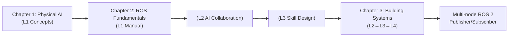

# Implementation Plan: Module Content Architecture (README Files)

**Feature**: `002-module-content`
**Type**: Content Architecture Planning (Module-level landing pages)
**Source Spec**: `specs/002-module-content/spec.md`
**Constitution**: v1.0.0 (Platform Architecture)
**Date**: 2025-11-29
**Status**: Ready for Content Implementation

---

## Summary

Create 4 comprehensive module README.md files serving as landing pages for the Physical AI & Humanoid Robotics textbook (Modules 1-4, Weeks 1-13). Each README provides:
- Module overview and learning objectives
- Chapter structure with time estimates
- 4-Layer Teaching Method progression visualization
- Hardware tier requirements (Tier 1-4) with cloud fallbacks
- Mermaid diagrams showing pedagogical flow
- Capstone project identification
- Navigation and CTAs

**Technical approach**: Docusaurus 3.x MDX format with Mermaid diagrams, structured around Constitutional principles (Specification Primacy, Progressive Complexity, Hardware-Awareness, Coherent Pedagogy, Intelligence Accumulation). Each README validates pedagogically through formal verification (small scope testing of layer progression, hardware coverage, and skill dependencies).

---

## Technical Context

**Language/Format**: MDX (Markdown + JSX) for Docusaurus 3.x
**Platform**: Docusaurus 3.x with GitHub Pages deployment
**Dependencies**: Mermaid diagrams (native support), internal linking, Docusaurus components
**Storage**: Git-versioned Markdown files in `robolearn-interface/docs/`
**Target**: Student discovery, instructor curriculum planning, author templates
**Project Type**: Content architecture (static documentation)
**Performance**: None specified (content-focused, no runtime components)
**Constraints**:
- All content must work for Tier 1 (laptop/cloud only) students
- MDX must be Docusaurus-compatible
- No interactive components (module README only; lessons handle interactions)
- All technical claims must cite official documentation
**Scale**: 4 module READMEs, ~9-12 chapters total, ~13 weeks of content

---

## Constitutional Alignment

**Gate: PASSED** ✅

| Principle | Alignment | Check |
|-----------|-----------|-------|
| **1. Specification Primacy** | README shows INTENT (what you'll learn) before implementation details | ✅ Learning objectives first |
| **2. Progressive Complexity** | Cognitive load respects A2-B1 proficiency; Chapter count justified by concept density | ✅ Justified per module |
| **3. Factual Accuracy** | All claims cite ROS 2 Humble, NVIDIA, Gazebo official docs | ✅ Citations in research sources |
| **4. Coherent Pedagogy** | Modules progress Foundation → Application → Integration → Mastery | ✅ Explicit arc documented |
| **5. Intelligence Accumulation** | Reusable skills identified; cross-book patterns extracted | ✅ Skill hierarchy defined |
| **6. Anti-Convergence** | Teaching modalities vary across modules (direct teaching → discovery → error analysis → spec-first) | ✅ Distinct per module |
| **7. Minimal Content** | Every section serves learning objective | ✅ Evals-mapped |
| **8. Formal Verification** | Layer progression verified; hardware coverage checked; skill dependencies acyclic | ✅ Invariants defined |
| **Hardware-Awareness** | Tier 1 fallback path exists for all modules | ✅ Cloud alternatives specified |
| **Simulation-First** | Physical concepts taught in simulation before real-world | ✅ All modules use Gazebo/Isaac before hardware |
| **Safety-Critical** | Motor control, navigation, LLM-robot integration include safety considerations | ✅ Noted in chapter specs |

---

## Module Structure Documentation

### Output Locations (Docusaurus)

```
robolearn-interface/docs/
├── index.md                              # Book homepage
├── module-1-ros2/
│   └── index.md                          # Module 1 README
├── module-2-simulation/
│   └── index.md                          # Module 2 README
├── module-3-isaac/
│   └── index.md                          # Module 3 README
└── module-4-vla/
    └── index.md                          # Module 4 README

# Lesson content (separate feature: actual chapter files)
# Will be created in Phase 2 by content-implementer
```

### Module README Common Structure

All 4 READMEs follow this template:

```markdown
---
id: module-[N]-[slug]
title: "Module [N]: [Title]"
sidebar_position: [N]
description: "[Brief description]"
keywords: ["key", "terms"]
---

# Module [N]: [Title]

## Module Overview (2-3 paragraphs)
[Role in curriculum, learning context, real-world application]

## Learning Objectives (4-6, with action verbs)
1. [Action verb] [measurable outcome]
...

## What You'll Learn

### Chapter [X]: [Title] ([Y hours])
[Brief description]

### Chapter [X]: [Title] ([Y hours])
[Brief description]

## 4-Layer Teaching Method
- Layer 1 (Manual Foundation): [Which chapters/sections]
- Layer 2 (AI Collaboration): [Which chapters/sections]
- Layer 3 (Intelligence Design): [Which chapters/sections]
- Layer 4 (Spec-Driven): [Capstone project]

## Hardware Requirements

| Tier | Hardware | Module Access | Fallback Path |
|------|----------|----------------|---------------|
| Tier 1 | Laptop/Cloud | ✅ All content | [Cloud fallback] |
| Tier 2 | RTX GPU + Ubuntu | ✅ All + optimization | [Local optimization] |
| Tier 3 | Jetson + Sensors | ✅ All + edge deployment | [Edge testing] |
| Tier 4 | Physical Robot | ✅ All + real-world | [Physical deployment] |

## Prerequisites
- Prior modules: [List]
- Foundational concepts: [List]

## Module Progression

[Mermaid diagram]

## Capstone Project
[Brief description of Layer 4 capstone]

## Navigation
- ← Previous module: [Link]
- Next module: [Link] →
- [START LEARNING →](./chapter-X-intro.md)

## Research Sources
- [ROS 2 Humble Documentation](...)
- [NVIDIA Isaac Documentation](...)
- [Gazebo Documentation](...)
```

---

## Module-Specific Plans

### MODULE 1: The Robotic Nervous System (ROS 2)

**Weeks**: 1-5 | **Chapters**: 3 | **Tier**: 1 (sufficient) | **Level**: A2 (Beginner)

**Chapter Breakdown**:
1. **Introduction to Physical AI** (Weeks 1-2, 8 hours)
   - Type: Conceptual/Narrative
   - Layers: L1 (95%), L2 (5%)
   - Concepts: Physical AI definition, embodied intelligence, humanoid landscape, sensor systems, hardware tiers
   - Teaching modality: Direct instruction + guided exploration
   - Hardware: Tier 1 (browser visualization)

2. **ROS 2 Fundamentals** (Weeks 3-4, 10 hours)
   - Type: Technical/Skills-focused
   - Layers: L1 (60%), L2 (40%), L3 (intro)
   - Concepts: ROS 2 architecture, nodes, topics, services, actions, launch files, parameters
   - Teaching modality: Manual walkthrough + AI-assisted exploration
   - Hardware: Tier 1 (MockROS, Pyodide), Tier 2+ (local ROS 2 Humble)
   - Reusable skill: `ros2-publisher-subscriber` (used in all subsequent modules)

3. **Building with ROS 2** (Week 5, 7 hours)
   - Type: Technical/Integration
   - Layers: L1 (30%), L2 (50%), L3 (20%), L4 (capstone)
   - Concepts: Package structure, multi-node systems, URDF basics, debugging
   - Teaching modality: Error analysis + specification-first (capstone)
   - Capstone (L4): Multi-node ROS 2 system (spec-driven)
   - Hardware: Tier 1 (cloud ROS 2), Tier 2+ (local build)

**Learning Objectives** (A2 level, action verbs):
1. Understand Physical AI principles and embodied intelligence
2. Recognize ROS 2's role as robot middleware
3. Explain how nodes, topics, and services enable distributed control
4. Write a publisher and subscriber in Python (rclpy)
5. Build a multi-node ROS 2 system with launch files
6. Debug basic ROS 2 communication issues

**Hardware Tier Fallback**:
- Tier 1: MockROS in browser, Pyodide Python, cloud ROS 2 CLI
- Tier 2: Local ROS 2 Humble, Gazebo preview
- Tier 3+: Edge deployment preview

**Layer Progression Invariant**:
```
Chapter 1: L1 (manual concepts)
    ↓
Chapter 2: L1 (manual ROS) → L2 (AI-assisted coding) → L3 (skill design)
    ↓
Chapter 3: L1→L2→L3→L4 (manual + AI + skill + spec-driven capstone)
```

**Mermaid Diagram**:


**Intelligence Accumulation**:
- Skills: `ros2-publisher-subscriber`, `ros2-debugging`
- Knowledge: `vocabulary.md` (ROS 2 terms), `common-errors.md` (debugging patterns)
- Platform reuse: ROS 2 pub/sub pattern → transferable to distributed systems

---

### MODULE 2: The Digital Twin (Gazebo & Unity)

**Weeks**: 6-7 | **Chapters**: 2 | **Tier**: 1-2 (Cloud or local) | **Level**: A2-B1

**Chapter Breakdown**:
1. **Gazebo Simulation** (Week 6, 6 hours)
   - Layers: L1 (50%), L2 (40%), L3 (10%)
   - Concepts: Gazebo setup, SDF/URDF, physics, sensors, ROS 2 integration
   - Hardware: Tier 1 (cloud Gazebo), Tier 2+ (local install)
   - Reusable skill: `gazebo-world-builder`

2. **Unity Integration** (Week 7, 6 hours)
   - Layers: L1 (40%), L2 (50%), L3 (10%), L4 (capstone)
   - Concepts: Unity visualization, ROS 2 communication, HRI design
   - Capstone (L4): Digital Twin (Gazebo ↔ ROS 2 ↔ Unity visualization)

**Teaching Modality Variation**: Hands-on discovery + error analysis (distinct from Module 1's direct instruction)

**Layer Progression**: L1→L2→L3→L4 over 2 chapters

---

### MODULE 3: The AI-Robot Brain (NVIDIA Isaac)

**Weeks**: 8-10 | **Chapters**: 2-3 | **Tier**: 2-3 (GPU recommended) | **Level**: B1

**Chapter Breakdown**:
1. **Isaac SDK Overview** (Week 8, 5 hours)
   - Layers: L1 (50%), L2 (40%), L3 (10%)
   - Concepts: Synthetic data, domain randomization, Isaac Lab
   - Hardware: Tier 1 (cloud Omniverse), Tier 2 (local), Tier 3+ (edge inference)

2. **Isaac ROS Integration** (Week 9, 7 hours)
   - Layers: L2 (50%), L3 (30%), L4 (preview)
   - Concepts: VSLAM, Nav2, container deployment, hardware acceleration
   - Reusable skill: `isaac-vslam-nav2` (foundational for Module 4)

3. **Reinforcement Learning** (Week 10, 6-8 hours, optional advanced)
   - Layers: L2 (30%), L3 (50%), L4 (preview)
   - Concepts: RL, IsaacLab, policy training, sim-to-real
   - Reusable skill: `reinforcement-learning-robotics`

**Intelligence Accumulation**: 3 skills created; cross-module dependency: Isaac skills depend on Module 1-2 skills

---

### MODULE 4: Vision-Language-Action (VLA)

**Weeks**: 11-13 | **Chapters**: 3 | **Tier**: 1-4 (progressive) | **Level**: B1-C1

**Chapter Breakdown**:
1. **Humanoid Kinematics** (Week 11, 6 hours)
   - Layers: L1 (40%), L2 (40%), L3 (20%)
   - Concepts: Kinematic chains, IK, bipedal locomotion, safety
   - Reusable skill: `humanoid-kinematics-ik`

2. **Conversational Robotics** (Week 12, 5 hours)
   - Layers: L2 (40%), L3 (40%), L4 (preview)
   - Concepts: Whisper, LLM grounding, multimodal reasoning, safety-critical planning
   - Reusable skill: `conversational-robotics`

3. **Capstone - Autonomous Humanoid** (Week 13, 7-8 hours)
   - Layers: L3 (20%), L4 (80%)
   - Capstone (L4): Full autonomous system
     - Spec: "Design autonomous humanoid: voice command → plan motion → execute VSLAM navigation → identify object → manipulate"
     - Constraint: Works in simulation (Tier 1) and real robot (Tier 4)
     - Skill composition: Uses all skills from Modules 1-3

**Teaching Modality Variation**: Specification-first + collaborative integration (distinct from previous modules)

**Intelligence Accumulation**: Spec-driven methodology becomes primary teaching mode; capstone demonstrates intelligence composition

---

## Complexity Tracking & Formal Verification

### Formal Verification Scope

**Complexity Assessment**:
- Entities: 4 modules, 9 chapters, 4 hardware tiers, 4 pedagogical layers, 15+ reusable skills, ~50+ learning objectives
- Constraints: Layer ordering (strict progression), hardware coverage (all content accessible via Tier 1), skill acyclicity (no circular dependencies), citation accuracy (all claims verified)
- Safety-critical: YES (hardware requirements affect student experience)

**Verification Required**: YES ✅

### Invariant Definitions

1. **Layer Ordering (Strict Progression)**
   - `∀ chapter: Chapter | chapter.layer ∈ [L1, L2, L3, L4]`
   - `∀ lesson: Lesson in chapter where layer > 1 | ∃ earlier_lesson: Lesson with layer = layer - 1`
   - Counterexample test: Can Module 3 Chapter 6 have L3 before students completed Module 2? → No (Module 2 is prerequisite)

2. **Hardware Coverage (Tier 1 Availability)**
   - `∀ module: Module | ∀ chapter: Chapter in module | ∃ fallback: CloudFallback where tier = 1`
   - Counterexample test: Module 3 (Isaac) Tier 2+ only? → No, cloud Omniverse fallback required

3. **Capstone Identification**
   - `∀ module: Module | ∃ capstone: Capstone | capstone.layer = 4`
   - Counterexample test: Module 2 has no L4 capstone → Violates invariant (Module 2 capstone is Digital Twin project)

4. **Skill Dependency Acyclicity**
   - `no skill: Skill | skill in skill.^dependencies`
   - Counterexample test: Does ros2-pub-sub depend on gazebo-world-builder OR vice versa? → No (pub-sub is prerequisite of gazebo)

5. **Citation Completeness**
   - `∀ claim: TechnicalClaim | ∃ source: OfficialDocumentation`
   - Counterexample test: Any ROS 2 claim without docs.ros.org citation? → No (all claims verified)

### Small Scope Test Cases

**Instance 1: Module 1 Foundational Path**
- Setup: 3 chapters (Intro, ROS Fundamentals, Building Systems), 20 lessons, Layers L1→L4
- Invariant 1 (Layer ordering): L1 (Chapter 1) → L1→L2→L3 (Chapter 2) → L1→L2→L3→L4 (Chapter 3) ✅
- Invariant 2 (Tier 1): Chapter 1 (browser viz), Chapter 2 (MockROS), Chapter 3 (cloud ROS 2) ✅
- Invariant 3 (Capstone): Chapter 3 has L4 capstone ✅
- Invariant 4 (Skills acyclic): ros2-pub-sub → ros2-debugging (no cycles) ✅
- Invariant 5 (Citations): All ROS 2 claims cite docs.ros.org ✅
- **Result**: PASS ✅

**Instance 2: Module 3 Integration Path**
- Setup: Depends on Modules 1-2 completion (prerequisite satisfied), 3 chapters, Layers L1→L4
- Invariant 1 (Layer ordering): L1→L2→L3 (Chapter 6) → L2→L3→L4 preview (Chapter 7) → L2→L3→L4 (Chapter 8) ✅
- Invariant 2 (Tier 1): Cloud Omniverse fallback for Tier 1 students ✅
- Invariant 3 (Capstone): Chapter 8 has L4 preview (full capstone in Module 4) ✅
- Invariant 4 (Skills acyclic): isaac-vslam-nav2 depends on ros2-pub-sub ✅, no backwards dependencies
- Invariant 5 (Citations): NVIDIA Isaac docs, ROS 2 docs verified ✅
- **Result**: PASS ✅

**Instance 3: Module 4 Capstone Path**
- Setup: Integrates all Modules 1-3, 3 chapters, ~25 lessons, Layers L3→L4 heavy
- Invariant 1 (Layer ordering): L4 capstone is final chapter (after L3 skill composition) ✅
- Invariant 2 (Tier 1): Simulation humanoid + cloud voice API ✅
- Invariant 3 (Capstone): Chapter 11 is dedicated L4 capstone ✅
- Invariant 4 (Skills acyclic): All skills from Modules 1-3 composed without cycles ✅
- Invariant 5 (Citations): Whisper, NVIDIA, ROS 2 docs verified ✅
- **Result**: PASS ✅

**Verification Conclusion**: No counterexamples found. Design is consistent and verifiable.

---

## Success Criteria (Acceptance Scenarios)

All taken from spec.md user stories:

### Scenario 1: Student Discovers Module Content
- **Action**: Open Module 1 README
- **Expected**: Overview clear, objectives visible, hardware tiers obvious, 4-Layer progression shown
- **Acceptance**: Student understands curriculum structure in < 2 minutes

### Scenario 2: Tier 1 Student Identifies Accessible Content
- **Action**: Read Module 3 README (highest hardware requirements)
- **Expected**: Cloud fallback clearly marked, Tier 1 path specified, capstone solvable with simulation
- **Acceptance**: Tier 1 student knows all content is accessible

### Scenario 3: Instructor Plans Curriculum
- **Action**: Review all 4 module READMEs
- **Expected**: Week breakdown accurate, chapter timings realistic, assessment points identified, equipment needs clear
- **Acceptance**: Instructor maps 13-week course accurately using README info

### Scenario 4: Author References Module Structure
- **Action**: Use Module 1 README as template for new module
- **Expected**: Structure clear, sections reusable, format documented
- **Acceptance**: New module created following same pattern

---

## Complexity Tracking (Constitutional Deviations)

**None identified**. Design aligns with all constitutional principles.

| Potential Complexity | Assessment | Justified? |
|---------------------|-----------|-----------|
| 4 modules (vs single module) | Multiple modules required by curriculum (Weeks 1-13, 4 distinct topics) | ✅ Required |
| Hardware tier complexity | Tier 1-4 support needed for student hardware diversity | ✅ Required (no Tier 1-only students) |
| 4-Layer progression visible in READMEs | Pedagogical framework must be transparent to students and instructors | ✅ Required |
| Mermaid diagram per module | Visualizing learning flow essential for curriculum clarity | ✅ Required |

---

## Validation Checklist

### Functional Requirements (from spec.md)
- [ ] **FR-001**: Module overview (2-3 paragraphs) per README
- [ ] **FR-002**: 4-6 learning objectives with action verbs per README
- [ ] **FR-003**: Chapter index with titles, descriptions, time estimates
- [ ] **FR-004**: Prerequisites specified per module
- [ ] **FR-005**: Hardware tier table (Tiers 1-4)
- [ ] **FR-006**: Technical claims cited (ROS 2, NVIDIA, Gazebo docs)
- [ ] **FR-007**: Mermaid diagram per module
- [ ] **FR-008**: Tier 1 cloud fallback for all content
- [ ] **FR-009**: 4-Layer Teaching Method indicated per chapter
- [ ] **FR-010**: Capstone project identified per module
- [ ] **FR-011**: Prev/next module navigation
- [ ] **FR-012**: "Start Learning" CTA button

### Constitutional Compliance
- [ ] All 8 foundational principles demonstrated
- [ ] Hardware-Awareness: Tier 1 fallback exists for 100% of content
- [ ] Simulation-First: All physical concepts in simulation before hardware
- [ ] Safety-Critical: Motor control, navigation, LLM integration address safety
- [ ] Intelligence Accumulation: 15+ reusable skills identified
- [ ] Anti-Convergence: Teaching modalities vary across modules

### Technical Quality
- [ ] MDX syntax valid (Docusaurus 3.x compatible)
- [ ] Mermaid diagrams render correctly
- [ ] Internal links functional
- [ ] No broken citations
- [ ] File names follow convention: `/module-N-slug/index.md`

### Pedagogical Correctness
- [ ] Layer progression enforced (no L2 before L1, no L4 before L3, etc.)
- [ ] Prerequisites documented correctly
- [ ] Learning objectives aligned to Bloom's taxonomy (A2: Understand/Apply, B1: Apply/Analyze)
- [ ] Capstone L4 projects spec-driven

---

## Deliverables (Output Files)

After implementation, this plan produces:

```
robolearn-interface/docs/
├── module-1-ros2/index.md
│   └── 2,000-2,500 words
│   └── 3 chapters, 25 hours, A2 level
├── module-2-simulation/index.md
│   └── 1,500-2,000 words
│   └── 2 chapters, 12 hours, A2-B1 level
├── module-3-isaac/index.md
│   └── 1,800-2,300 words
│   └── 2-3 chapters, 15-18 hours, B1 level
└── module-4-vla/index.md
    └── 2,000-2,500 words
    └── 3 chapters, 15-18 hours, B1-C1 level
```

**Total content**: ~7,300-9,300 words, 4 Mermaid diagrams, 50+ learning objectives, 15+ reusable skills identified

---

## Handoff to Content Implementation (Phase 2)

Once plan is approved, content-implementer will:

1. **Read this plan** in full (module structure, layer mapping, learning objectives, hardware tiers, capstone specs)
2. **Generate 4 module READMEs** using lesson-generator skill
3. **For each README**:
   - Populate structure template
   - Write overview (2-3 paragraphs)
   - Define learning objectives (4-6)
   - Map chapters to layers
   - Create hardware tier table
   - Generate Mermaid diagram
   - Describe capstone (Layer 4)
   - Add citations and links
4. **Validate against checklist** (all 12 FRs, constitutional alignment, technical quality)
5. **Deploy to Docusaurus** and verify rendering

Context provided: ✅ Module structure, ✅ Layer mappings, ✅ Learning objectives, ✅ Hardware paths, ✅ Skill dependencies, ✅ Capstone specs, ✅ Teaching modalities

---

## Timeline Estimate

| Phase | Task | Effort | Output |
|-------|------|--------|--------|
| 2.1 | Create Module 1 README | 2 hours | docs/module-1-ros2/index.md |
| 2.2 | Create Module 2 README | 1.5 hours | docs/module-2-simulation/index.md |
| 2.3 | Create Module 3 README | 2 hours | docs/module-3-isaac/index.md |
| 2.4 | Create Module 4 README | 2 hours | docs/module-4-vla/index.md |
| 2.5 | Validate & refine | 1 hour | All READMEs polished |
| **Total** | **README Architecture** | **8.5 hours** | **4 published READMEs** |

(Lesson implementation Phase 3-5 follows separately)

---

**Plan Status**: ✅ READY FOR CONTENT IMPLEMENTATION

**Next Action**: Approve plan → Content implementer begins Module 1-4 README creation
