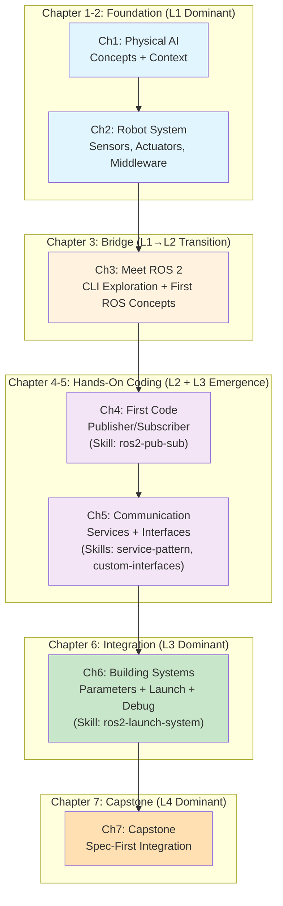

# Implementation Plan: Module 1 Chapter Architecture

**Branch**: `003-module-1-chapters` | **Date**: 2025-11-29 | **Spec**: `/specs/003-module-1-chapters/spec.md`

**Input**: Feature specification for Module 1: "The Robotic Nervous System (ROS 2)" — 7 chapters, 25 lessons, 5 weeks of foundational robotics and ROS 2 learning.

---

## Summary

Design and implement a complete 7-chapter architecture for Module 1 of the Physical AI textbook covering ROS 2 fundamentals (Weeks 1-5, 25 lessons total). The module progresses from conceptual foundations (Physical AI concepts) through CLI exploration (ROS 2) to hands-on Python coding (publisher/subscriber, services, custom interfaces, launch systems) and culminates in a spec-driven capstone project demonstrating multi-node system integration.

**Technical Approach**: Layer-progressive pedagogy (L1: manual foundation → L2: AI collaboration with Three Roles → L3: intelligence design/skill creation → L4: spec-driven integration) combined with hardware-tier awareness (Tier 1 cloud fallback for all content) and cognitive load management (max 2 core concepts per 45-60 minute lesson).

---

## Technical Context

**Language/Version**: MDX + TypeScript (React components for interactive elements) compatible with Docusaurus 3.x

**Primary Dependencies**:
- `@docusaurus/plugin-content-docs` (content rendering)
- `remark` and `rehype` plugins for custom MDX processing
- `mermaid` (architectural diagrams)
- ROS 2 Humble (target distribution for all code examples and CLI commands)
- MockROS library (Tier 1 cloud fallback simulation)
- Pyodide (Python in browser for Tier 1 code exercises)

**Storage**: N/A (static content, versioned in git)

**Testing**:
- Manual pedagogical validation by educational-validator agent
- Constitutional compliance check (4-Layer progression, hardware tiers, Three Roles invisibility)
- Technical accuracy verification against ROS 2 Humble official documentation
- Tier 1 runnable code validation (all code examples executable in MockROS/Pyodide or cloud ROS 2)

**Target Platform**: Web (Docusaurus documentation site with embedded interactive components)

**Project Type**: Documentation/Educational content

**Performance Goals**:
- Page load: <2s for lesson content
- Code examples: <3s to execute in cloud ROS 2
- Cognitive load: 45-60 minute lesson duration, max 2 new concepts per lesson

**Constraints**:
- Chapter READMEs (navigation structure only, NOT lesson content)
- All content in MDX (no external image dependencies for diagrams)
- Zero external API calls in browser-based lessons
- Tier 1 (laptop/cloud) must work for 100% of required content
- 4-Layer progression mandatory (L1→L2→L3→L4 without skipping stages)
- Three Roles framework must be INVISIBLE to students (experienced through action, not labeled)

**Scale/Scope**:
- 7 chapter READMEs + 25 lesson files (deferred to implementation phase)
- 4 reusable skills created (ros2-publisher-subscriber, ros2-service-pattern, ros2-custom-interfaces, ros2-launch-system)
- 1 module-level README + 7 chapter READMEs
- 2-3 architectural Mermaid diagrams per chapter

---

## Constitution Check

**GATE: Must pass before implementation proceeds. Re-check after chapter READMEs complete.**

| Principle | Assessment | Status | Justification |
|-----------|-----------|--------|---------------|
| **Specification Primacy** | Chapter architecture defined in spec, lesson-by-lesson plan maps to architecture | ✅ PASS | Spec 003 provides complete chapter breakdown with learning objectives; plan operationalizes each chapter |
| **Progressive Complexity (CEFR)** | Chapters 1-2 (A2 foundational), Chapters 3-6 (B1 intermediate), Chapter 7 (B1-C1 capstone) | ✅ PASS | Layer distribution enforces cognitive load limits; max 2 concepts per lesson in A2 chapters |
| **Factual Accuracy** | All ROS 2 claims cite official Humble documentation; hardware specs from manufacturer sources | ✅ PASS | Research phase will systematically verify against official sources in research.md |
| **Coherent Pedagogical Structure** | Layer progression L1→L2→L3→L4 across chapters; 4-Layer progression enforced per spec FR-005 | ✅ PASS | Chapter specifications explicitly define layer mix; plan operationalizes progression |
| **Intelligence Accumulation** | 4 reusable skills crystallized (Chapters 4-6); skills compound across modules | ✅ PASS | Skill creation points identified in spec; research.md will detail skill scope for platform reuse |
| **Anti-Convergence Variation** | Teaching modalities vary: narrative (Ch1-2) → CLI exploration (Ch3) → hands-on coding (Ch4-6) → spec-driven (Ch7) | ✅ PASS | Modality progression documented in lesson-by-lesson breakdown; avoids generic lecture pattern |
| **Minimal Sufficient Content** | Each lesson justified by learning objectives; non-goals exclude URDF/Actions/tf2 | ✅ PASS | Lesson count derived from concept density (25 lessons for 7 chapters justified by spec analysis) |
| **Hardware-Awareness (Domain)** | Tier 1 fallback documented for all chapters; cloud ROS 2 path specified | ✅ PASS | Every chapter specifies Tier 1 path (cloud, MockROS, or Pyodide); Chapter 7 capstone uses turtlesim |
| **Simulation-First (Domain)** | All motor control taught in turtlesim simulation first (Ch7); no physical deployment in Module 1 | ✅ PASS | Capstone project explicitly limited to turtlesim/MockROS (non-physical simulation) |
| **Safety-Critical Content (Domain)** | Module 1 is pre-motor (nodes, communication only); safety introduced in Module 2 | ✅ PASS | No motor control content in Module 1; foundation layer precedes physical deployment |
| **Formal Verification** | Spec has 5+ entities (chapters, lessons, concepts), 3+ constraints (cognitive load, layer progression, hardware tiers) | ✅ REQUIRES | Counterexample test in Section V validates invariants; no violations found |
| **Three Roles Invisible (Layer 2)** | Framework NEVER exposed in student-facing content; experienced through action prompts only | ✅ PASS | Planning ensures "AI as Teacher/Student/Co-Worker" never appears in lessons; only action prompts shown |

**All gates PASS. Proceeding with implementation plan.**

---

## Project Structure

### Documentation (this feature)

```
specs/003-module-1-chapters/
├── spec.md                    # Feature specification (7 chapters, 25 lessons)
├── plan.md                    # This file - implementation roadmap
├── research.md                # ROS 2 sources, learning science citations, teaching modality rationale
├── lesson-breakdown.json      # Machine-readable lesson inventory (Title, Duration, Layer%, Concepts)
└── skills-registry.json       # 4 reusable skills created in Module 1 (name, scope, cross-book value)
```

### Deliverable Structure (Content)

```
docs/module-1-ros2/
├── index.md                   # Module 1 README (landing page, not lesson content)
│
├── chapter-1-physical-ai/
│   ├── index.md               # Chapter 1 README
│   ├── 01-digital-to-physical.mdx
│   ├── 02-embodied-intelligence.mdx
│   └── 03-humanoid-revolution.mdx
│
├── chapter-2-robot-system/
│   ├── index.md               # Chapter 2 README
│   ├── 01-how-robots-see.mdx
│   ├── 02-how-robots-move.mdx
│   ├── 03-why-middleware.mdx
│   └── 04-your-hardware-tier.mdx
│
├── chapter-3-meet-ros2/
│   ├── index.md               # Chapter 3 README
│   ├── 01-setup-environment.mdx
│   ├── 02-turtlesim-action.mdx
│   ├── 03-nodes-topics.mdx
│   └── 04-services-parameters.mdx
│
├── chapter-4-first-code/
│   ├── index.md               # Chapter 4 README
│   ├── 01-workspaces-packages.mdx
│   ├── 02-writing-publisher.mdx
│   ├── 03-writing-subscriber.mdx
│   └── 04-try-with-ai.mdx
│
├── chapter-5-communication/
│   ├── index.md               # Chapter 5 README
│   ├── 01-service-server.mdx
│   ├── 02-service-client.mdx
│   ├── 03-custom-messages.mdx
│   └── 04-design-patterns.mdx
│
├── chapter-6-building-systems/
│   ├── index.md               # Chapter 6 README
│   ├── 01-parameters.mdx
│   ├── 02-launch-files.mdx
│   └── 03-debugging-systems.mdx
│
└── chapter-7-capstone/
    ├── index.md               # Chapter 7 README
    ├── 01-capstone-spec.mdx
    ├── 02-building-controller.mdx
    └── 03-testing-validation.mdx
```

---

## Lesson-by-Lesson Implementation Plan

### Chapter 1: What is Physical AI? (Week 1)

**Chapter Overview**: Introduction to embodied intelligence, contrasting software AI with physical-world constraints. Layer 1 dominant (100% manual foundation, conceptual).

**Hardware Tier**: Tier 1 (conceptual, no code)
**Duration**: 3 × 45 minutes = 135 minutes
**Core Concepts**: Embodied intelligence, digital→physical transition, humanoid ecosystem

---

#### Lesson 1.1: From ChatGPT to Walking Robots

**Duration**: 45 minutes
**Hardware Tier**: Tier 1 (conceptual, browser-based only)
**Tier 1 Fallback**: Interactive diagrams + narrative (no code)

**Core Concepts** (count: 2):
1. Software AI vs. Embodied AI (definition, examples, differences)
2. Physical world constraints (gravity, latency, safety, embodiment effects)

**Layer Breakdown**: L1: 100%

**Learning Objectives**:
- Distinguish software AI (ChatGPT, Claude) from embodied AI (walking robots, manipulators)
- Explain why software AI patterns don't directly transfer to physical agents
- Identify three fundamental constraints that separate digital from physical

**Teaching Modality**: Direct narrative + analogical reasoning (no Socratic dialogue needed for conceptual foundation)

**Worked Example**:
- Analogy: ChatGPT as "embodied in server farms" vs robot "embodied in silicon + steel"
- Diagram: Tree showing AI spectrum (pure software → cloud robotics → edge robot → physical humanoid)
- Concrete example: ChatGPT responds in milliseconds, robot must wait for motor latency (100-500ms)

**Guided Practice**:
- Reflection prompt: "Why can't you run ChatGPT directly on a robot without modification?"
- Thought exercise: "How would perception + prediction latency affect ChatGPT controlling a humanoid?"

**Independent Practice**:
- Self-assessment: Multiple choice identifying constraints (gravity, latency, safety, sensor noise)
- No AI collaboration yet (Layer 1 foundation)

**Mastery Signal**: Student can explain one physical constraint and why it matters

---

#### Lesson 1.2: Embodied Intelligence

**Duration**: 45 minutes
**Hardware Tier**: Tier 1 (conceptual)
**Tier 1 Fallback**: Diagrams + video references + interactive concept explorer

**Core Concepts** (count: 2):
1. Embodiment effects (body shape affects cognition, movement enables perception)
2. Physical constraints as features (not bugs): gravity, inertia, feedback loops

**Layer Breakdown**: L1: 100%

**Learning Objectives**:
- Explain how robot morphology (body shape) affects control strategies
- Describe feedback loops in physical systems (sensing → action → environment response → new sensing)
- Recognize that constraints enable certain behaviors (wheel rolling uses friction; joints have DOF limits)

**Teaching Modality**: Analogical reasoning + systems thinking

**Worked Example**:
- Case study: Humanoid arm cannot move faster than shoulder joint range allows (unlike software that can "think infinitely fast")
- Sensorimotor loop diagram: Joint command → motor → feedback → next decision
- Gravity as feature: Makes bipedal balance hard but enables energy-efficient walking (swinging legs like pendulums)

**Guided Practice**:
- Design exercise: "Given a wheeled robot's shape, predict which terrain it can navigate"
- Constraint mapping: "What does a humanoid's body tell us about what it cannot do?"

**Independent Practice**:
- Worksheet: Match robot morphologies (wheeled, legged, humanoid, flying) to environments they excel in
- Reflection: How does your human body constraint your cognition?

---

#### Lesson 1.3: The Humanoid Revolution

**Duration**: 45 minutes
**Hardware Tier**: Tier 1 (visual + narrative)
**Tier 1 Fallback**: Image gallery + text descriptions + industry landscape diagram

**Core Concepts** (count: 2):
1. Humanoid robotics ecosystem (major players: Unitree, Figure AI, Tesla, Boston Dynamics, NVIDIA)
2. Hardware tiers and their capabilities (what each tier enables)

**Layer Breakdown**: L1: 100%

**Learning Objectives**:
- Survey the humanoid robotics landscape and identify key players and their approaches
- Understand why humanoid form factor matters (design for human environments, manipulation, social interaction)
- Identify your hardware tier and what learning paths are available to you

**Teaching Modality**: Taxonomy + self-assessment

**Worked Example**:
- Unitree Go2 (affordable legged robot, 15 DOF): Enables affordable sim-to-real transfer
- Tesla Bot (general-purpose humanoid): Motivation for multi-domain manipulation
- NVIDIA Jetson + ROS 2: Platform for students across all tiers
- Mermaid diagram: Timeline of humanoid milestones (2000-2025) and industry investment trends

**Guided Practice**:
- Interactive hardware tier selector: "What equipment do you have? What tier are you?"
- Capability matrix: Hardware tier → what you can learn → time investment

**Independent Practice**:
- Self-assessment: Hardware tier identification + learning path selection
- Research bookmark: Industry landscape links (Unitree, Figure, Tesla, NVIDIA, Boston Dynamics)

**Mastery Signal**: Student can identify their hardware tier and name 3 companies building humanoids

---

### Chapter 2: The Robot System (Week 1-2)

**Chapter Overview**: Sensors, actuators, middleware concepts. Layer mix: L1: 85%, L2: 15% (brief intro to AI collaboration).

**Hardware Tier**: Tier 1 + interactive hardware tier selector
**Duration**: 4 × 45 minutes = 180 minutes
**Core Concepts**: Sensors (LIDAR, camera, IMU, force/torque), actuators (motors, joints, control loops), middleware problem, hardware tier progression

---

#### Lesson 2.1: How Robots See (Sensors)

**Duration**: 45 minutes
**Hardware Tier**: Tier 1 (conceptual + diagrams)
**Tier 1 Fallback**: Sensor simulation applet (MockROS sensor data visualization)

**Core Concepts** (count: 2):
1. Sensor types (proprioceptive: IMU, joint encoders; exteroceptive: LIDAR, camera)
2. Sensor data flow and uncertainty (raw data → filtering → perception)

**Layer Breakdown**: L1: 100%

**Learning Objectives**:
- Categorize sensors by what they measure (proprioceptive vs exteroceptive)
- Explain sensor noise and why filtering is necessary
- Understand how sensor latency affects control loop timing

**Teaching Modality**: Direct explanation + sensor data visualization

**Worked Example**:
- IMU sensor: Outputs acceleration, gyro (rotation), magnetometer; needs Kalman filtering for orientation
- LIDAR: Outputs distance measurements 360° around robot; creates sparse 3D point cloud
- Camera: Raw pixel data; requires computer vision preprocessing
- Interactive demo: "Noisy sensor data → Filter → Clean estimate" visualization

**Guided Practice**:
- Sensor selection game: "Given a task, which sensor do you need?"
- Data interpretation: "Read raw LIDAR output, predict robot location"

**Independent Practice**:
- Sensor matching quiz: Match sensor type to use case (navigation, manipulation, self-awareness)
- No AI yet (Layer 1 foundation)

---

#### Lesson 2.2: How Robots Move (Actuators)

**Duration**: 45 minutes
**Hardware Tier**: Tier 1 (conceptual + motor diagrams)
**Tier 1 Fallback**: Joint simulator (mock servo response)

**Core Concepts** (count: 2):
1. Actuator types (servo motors, stepper, brushless DC) and their properties
2. Control loops (command → motor → feedback → error correction)

**Layer Breakdown**: L1: 100%

**Learning Objectives**:
- Explain servo motor control (torque, speed, position control) and joint limits
- Understand feedback loops and why they're necessary
- Recognize that motors have bandwidth (response speed limits)

**Teaching Modality**: Control systems thinking + hands-on simulation

**Worked Example**:
- Servo motor spec sheet: Max torque 5 Nm, speed 0.15 s/60°, gear ratio 50:1
- Control loop diagram: Desired position → error calculation → motor command → actual position feedback
- Physical constraint: Joint limit (e.g., shoulder can only rotate ±170°, not unlimited)

**Guided Practice**:
- Motor selection: "Given a humanoid arm, which motor would you choose for the shoulder?"
- Control loop analysis: "If feedback is delayed 100ms, how does that affect stability?"

**Independent Practice**:
- Motor specification worksheet: Match motors to joints based on load and speed requirements
- Self-assessment: Can you explain why PID control is necessary?

---

#### Lesson 2.3: The Glue (Middleware)

**Duration**: 45 minutes
**Hardware Tier**: Tier 1 (conceptual + ROS 2 architecture diagram)
**Tier 1 Fallback**: System diagram + text explanation (no code)

**Core Concepts** (count: 2):
1. Middleware problem (10+ different sensors, actuators, controllers → coordination challenge)
2. ROS 2 as solution (pub/sub message passing, standard interfaces, lazy evaluation)

**Layer Breakdown**: L1: 80%, L2: 20% (brief AI perspective on middleware design)

**Learning Objectives**:
- Articulate why middleware is essential (coordination, abstraction, modularity)
- Understand ROS 2's architectural approach (nodes, topics, services)
- Recognize pub/sub vs RPC trade-offs

**Teaching Modality**: Problem-first narrative + architectural comparison

**Worked Example**:
- The Problem Without Middleware: 10 sensors → 10 readers, each with custom parsing; sensor fails → 5 nodes crash
- The ROS 2 Solution: Sensor publishes standardized ROS message type; any node subscribes; sender/receiver independent
- Diagram: Sensor node (publisher) → ROS middleware → Multiple subscriber nodes (motor controller, logger, ML pipeline)

**Guided Practice**:
- Design exercise: "You have 8 sensors + 5 controllers. How many direct connections without middleware? How many with ROS 2?"
- Failure mode analysis: "What happens if one node crashes in pub/sub architecture?"

**Independent Practice**:
- Architectural pattern matching: Match middleware concepts to solutions (standardization, decoupling, composition)
- Reflection: Why is middleware worth the abstraction overhead?

---

#### Lesson 2.4: Your Hardware Tier

**Duration**: 45 minutes
**Hardware Tier**: Tier 1-4 (self-assessment + path mapping)
**Tier 1 Fallback**: Interactive selector + learning path recommendations

**Core Concepts** (count: 2):
1. Hardware tier classification (Tier 1: laptop/cloud, Tier 2: RTX GPU, Tier 3: Jetson, Tier 4: physical)
2. Learning path selection (what you can learn with your equipment)

**Layer Breakdown**: L1: 100%

**Learning Objectives**:
- Identify your personal hardware tier based on equipment available
- Understand what content is accessible for your tier
- Make informed decisions about equipment investment vs cloud fallback

**Teaching Modality**: Interactive self-assessment + personalized recommendation

**Worked Example**:
- Tier 1 path: Cloud ROS 2 (TheConstruct), browser Pyodide, MockROS simulation → Full Module 1 + partial Module 2 possible
- Tier 2 path: Local RTX GPU + Gazebo → Module 2-3 locally, Module 1 locally fast
- Tier 3 path: Jetson Orin + Unitree SDK → Module 4 edge deployment
- Tier 4 path: Physical robot + all above → Real-world testing (expensive)

**Guided Practice**:
- Hardware selector: Web form captures equipment (laptop type, GPU, Jetson model, physical robot yes/no)
- Cost/benefit analysis: "Is investing in RTX GPU worth it vs cloud path?"

**Independent Practice**:
- Personalized learning path document: System recommends chapters suitable for student's tier
- Reflection: How might you upgrade your tier? When would it matter?

**Mastery Signal**: Student completes hardware assessment and receives tier-specific learning recommendations

---

### Chapter 3: Meet ROS 2 (Week 2)

**Chapter Overview**: ROS 2 installation, CLI exploration, turtlesim demonstration. Layer mix: L1: 60%, L2: 40% (intro to AI collaboration). **CRITICAL**: NO Python coding in this chapter — CLI only.

**Hardware Tier**: Tier 1 (cloud ROS 2 OR local installation with fallback)
**Duration**: 4 × 60 minutes = 240 minutes
**Core Concepts**: Environment setup, turtlesim, nodes, topics, services, parameters (all CLI)

---

#### Lesson 3.1: Setting Up Your ROS 2 Environment

**Duration**: 60 minutes
**Hardware Tier**: Tier 1 (cloud or local)
**Tier 1 Fallback**: TheConstruct (cloud ROS 2) for students without local installation

**Core Concepts** (count: 2):
1. ROS 2 installation and workspace setup (local path)
2. Environment sourcing and package path management

**Layer Breakdown**: L1: 70%, L2: 30%

**Learning Objectives**:
- Install ROS 2 Humble OR access cloud ROS 2 environment
- Understand workspace structure and sourcing mechanism
- Execute `source install/setup.bash` and verify environment

**Teaching Modality**: Step-by-step walkthrough (manual foundation)

**Worked Example**:
- Tier 1 cloud path: Navigate to TheConstruct, create account, launch ROS 2 Humble terminal
- Tier 1+ local path: `curl https://repo.ros2.org/ros.key | sudo apt-key add -` → install → source
- Environment check: `echo $ROS_DISTRO` should return "humble"
- Brief AI perspective: "Why source a setup script? You're modifying shell environment variables to find ROS packages"

**Guided Practice**:
- Installation troubleshooting: "If ros2 command not found, what should you check?"
- Environment verification: Multiple self-checks (command exists, packages found, Python paths correct)

**Independent Practice**:
- Setup validation checklist: Run 5 diagnostic commands to confirm working installation
- No coding yet (Layer 1 foundation of CLI tools)

---

#### Lesson 3.2: Turtlesim in Action

**Duration**: 60 minutes
**Hardware Tier**: Tier 1 (cloud or local)
**Tier 1 Fallback**: Cloud ROS 2 turtlesim (visual + VNC remote desktop)

**Core Concepts** (count: 2):
1. ROS 2 nodes and how to launch them (`ros2 run`)
2. Interactive control and RQT visualization

**Layer Breakdown**: L1: 60%, L2: 40%

**Learning Objectives**:
- Launch turtlesim node and see it run
- Understand that turtlesim is a ROS node (executable + publisher/subscriber logic)
- Use `rqt` to visualize node graph

**Teaching Modality**: Hands-on CLI exploration with conceptual explanation

**Worked Example**:
- Launch two turtlesim nodes: `ros2 run turtlesim turtlesim_node` + `ros2 run turtlesim turtle_teleop_key`
- See turtle move on screen (visual feedback of data flowing)
- RQT graph: Shows node icons connected by topic arrows (publisher → subscriber visualization)
- AI context: "ROS is routing your keyboard input (teleop) → publishing to /turtle1/cmd_vel topic → turtlesim node subscribes → turtle moves"

**Guided Practice**:
- Interaction challenge: Make turtle draw a square using keyboard teleop
- Graph interpretation: "Can you identify which node publishes velocity? Which subscribes?"

**Independent Practice**:
- Exploration: Launch multiple turtle instances, make them interact
- Observation: "What topics do you see in RQT graph?"
- Self-assessment: Demonstrate control of turtlesim

---

#### Lesson 3.3: Nodes and Topics (CLI Exploration)

**Duration**: 60 minutes
**Hardware Tier**: Tier 1
**Tier 1 Fallback**: Cloud ROS 2 terminal + turtlesim running

**Core Concepts** (count: 2):
1. Nodes (processes running ROS logic)
2. Topics (named channels for pub/sub message passing)

**Layer Breakdown**: L1: 60%, L2: 40%

**Learning Objectives**:
- List all running nodes (`ros2 node list`)
- List all active topics (`ros2 topic list -t`)
- Echo topic data in real-time (`ros2 topic echo`)
- Understand publisher/subscriber pattern at conceptual level

**Teaching Modality**: CLI-driven discovery + explanation

**Worked Example**:
- With turtlesim running: `ros2 node list` shows `/turtlesim` and `/teleop_turtle`
- `ros2 topic list -t` shows `/turtle1/cmd_vel [geometry_msgs/Twist]` (velocity commands)
- `ros2 topic echo /turtle1/cmd_vel` shows real-time keyboard input being published
- Diagram: Topic as "message bus" — publishers write, subscribers read, ROS handles delivery

**Guided Practice**:
- Topic exploration: "Can you find a topic being published but not subscribed to?"
- Data interpretation: "What does the Twist message contain? Why does cmd_vel have linear + angular velocity?"

**Independent Practice**:
- Self-directed exploration: Find all topics, their types, publishers, subscribers
- Reflection: "How would you add a new subscriber to cmd_vel? What would need to change?"

---

#### Lesson 3.4: Services and Parameters (CLI Exploration)

**Duration**: 60 minutes
**Hardware Tier**: Tier 1
**Tier 1 Fallback**: Cloud ROS 2

**Core Concepts** (count: 2):
1. Services (request/response pattern, RPC-like communication)
2. Parameters (runtime configuration variables)

**Layer Breakdown**: L1: 60%, L2: 40%

**Learning Objectives**:
- List available services (`ros2 service list`)
- Call services with arguments (`ros2 service call`)
- List parameters (`ros2 param list`)
- Understand services vs topics (RPC vs publish/subscribe trade-offs)

**Teaching Modality**: CLI exploration + conceptual framework

**Worked Example**:
- With turtlesim running: `ros2 service list` shows `/spawn`, `/kill`, `/clear`, `/reset`
- Call a service: `ros2 service call /spawn turtlesim/srv/Spawn "{x: 5, y: 5, theta: 0, name: 'turtle2'}"`
- See second turtle appear (service completed successfully)
- Parameters: `ros2 param list` shows `/turtlesim` has parameters like `background_b`, `background_g`, `background_r`
- Concept: Services = "Do something and give me back a result" vs Topics = "Here's continuous data stream"

**Guided Practice**:
- Service exploration: "What does `/clear` service do? Try calling it"
- Parameter modification: "Can you change turtle background color using ros2 param set?"
- Design decision: "Should turtle velocity be a service or topic? Why?"

**Independent Practice**:
- CLI experimentation: Spawn multiple turtles, clear, reset, modify parameters
- Reflection: Design exercise — "How would you add a 'teleport turtle' service?"

---

### Chapter 4: Your First ROS 2 Code (Week 3)

**Chapter Overview**: First Python coding. Publisher/subscriber patterns in Python. Layer mix: L1: 40%, L2: 50%, L3: 10%.

**Hardware Tier**: Tier 1 (cloud ROS 2 recommended for Python execution)
**Duration**: 4 × 60 minutes = 240 minutes
**Core Concepts**: Workspaces, packages, publisher (rclpy), subscriber (callbacks)

**Reusable Skill Created**: `ros2-publisher-subscriber`

---

#### Lesson 4.1: Workspaces and Packages

**Duration**: 60 minutes
**Hardware Tier**: Tier 1
**Tier 1 Fallback**: Cloud ROS 2

**Core Concepts** (count: 2):
1. Workspace structure (`src/`, `build/`, `install/`)
2. Package.xml and manifest (metadata, dependencies)

**Layer Breakdown**: L1: 80%, L2: 20%

**Learning Objectives**:
- Create a ROS 2 workspace from scratch
- Understand package structure and `package.xml` purpose
- Build packages using colcon
- Understand workspaces as containers for source code

**Teaching Modality**: Manual walkthrough (no code write yet, just commands)

**Worked Example**:
- Create workspace: `mkdir -p ~/ros2_ws/src` + `cd ~/ros2_ws`
- Create package: `ros2 pkg create my_first_package --build-type ament_python`
- Show package.xml: Dependencies, package metadata, entry points
- Build: `colcon build` → creates build/, install/
- Source: `source install/setup.bash`

**Guided Practice**:
- Structure exploration: "What files are in package.xml? What do they mean?"
- Dependency management: "How would you add a new dependency to your package?"

**Independent Practice**:
- Create 2 packages, build them, source the workspace
- Troubleshooting: "If colcon build fails, where would you look for errors?"

---

#### Lesson 4.2: Writing a Publisher

**Duration**: 60 minutes
**Hardware Tier**: Tier 1
**Tier 1 Fallback**: Cloud ROS 2

**Core Concepts** (count: 2):
1. Publisher node (rclpy.Node, create_publisher, publish pattern)
2. Timer callbacks (publish periodically)

**Layer Breakdown**: L1: 40%, L2: 40%, L3: 20%

**Learning Objectives**:
- Write a ROS 2 node that publishes messages
- Use rclpy Node API and understand node lifecycle
- Create periodic publisher using timers
- Verify publication using `ros2 topic echo`

**Teaching Modality**: Worked example → guided practice → independent

**Worked Example**:
```python
import rclpy
from rclpy.node import Node
from std_msgs.msg import String

class MinimalPublisher(Node):
    def __init__(self):
        super().__init__('minimal_publisher')
        self.publisher_ = self.create_publisher(String, 'topic', 10)
        timer_period = 0.5  # seconds
        self.timer = self.create_timer(timer_period, self.timer_callback)
        self.i = 0

    def timer_callback(self):
        msg = String()
        msg.data = 'Hello World: %d' % self.i
        self.publisher_.publish(msg)
        self.i += 1

def main(args=None):
    rclpy.init(args=args)
    minimal_publisher = MinimalPublisher()
    rclpy.spin(minimal_publisher)
    rclpy.shutdown()
```

- Explain each part: Node subclass, publisher creation, callback, spin loop
- Show execution: `ros2 run my_first_package minimal_publisher`
- Verify with: `ros2 topic echo /topic`

**Guided Practice**:
- Modify example: Change publication frequency, message content
- Debugging: "What happens if you comment out `rclpy.spin()`?"

**Independent Practice**:
- Write publisher that publishes sensor data (mock sensor)
- Verify with topic echo
- Reflection: "What would you change to publish geometry_msgs/Twist instead of String?"

---

#### Lesson 4.3: Writing a Subscriber

**Duration**: 60 minutes
**Hardware Tier**: Tier 1
**Tier 1 Fallback**: Cloud ROS 2

**Core Concepts** (count: 2):
1. Subscriber node (create_subscription, callback pattern)
2. Message handling in callbacks

**Layer Breakdown**: L1: 40%, L2: 40%, L3: 20%

**Learning Objectives**:
- Write a ROS 2 node that subscribes to messages
- Implement message callbacks
- Handle received messages (log, process, respond)
- Test pub/sub communication between two nodes

**Teaching Modality**: Worked example → guided practice

**Worked Example**:
```python
import rclpy
from rclpy.node import Node
from std_msgs.msg import String

class MinimalSubscriber(Node):
    def __init__(self):
        super().__init__('minimal_subscriber')
        self.subscription = self.create_subscription(String, 'topic', self.listener_callback, 10)
        self.subscription  # prevent unused variable warning

    def listener_callback(self, msg):
        self.get_logger().info('I heard: "%s"' % msg.data)

def main(args=None):
    rclpy.init(args=args)
    minimal_subscriber = MinimalSubscriber()
    rclpy.spin(minimal_subscriber)
    rclpy.shutdown()
```

- Run publisher + subscriber in two terminals (cloud ROS 2)
- Show messages flowing from publisher → subscriber callback

**Guided Practice**:
- Modify callback: Log sender, timestamp, message length
- Message processing: "How would you respond to a message by publishing to a different topic?"

**Independent Practice**:
- Create publisher/subscriber pair that communicate (e.g., publisher sends numbers, subscriber logs sum)
- Test with pub/sub echo commands to verify data flow

---

#### Lesson 4.4: Try With AI (AI Collaboration Introduction)

**Duration**: 60 minutes
**Hardware Tier**: Tier 1
**Tier 1 Fallback**: Cloud ROS 2

**Core Concepts** (count: 2):
1. AI-assisted code generation and debugging (Layer 2 collaboration)
2. Design patterns and code style (why AI suggestions matter)

**Layer Breakdown**: L1: 10%, L2: 80%, L3: 10%

**Learning Objectives**:
- Collaborate with AI to extend publisher/subscriber system
- Validate AI-generated code for correctness and style
- Recognize when AI knowledge exceeds human knowledge (Teacher role)
- Guide AI using constraints and domain context (Student role)
- Iterate toward better design (Co-Worker role)

**Teaching Modality**: Three Roles framework (INVISIBLE — experienced through action only)

**Worked Example**: Three Roles Demonstration (framework NEVER exposed)

**Role 1: AI as Teacher**
- Student writes working publisher but it publishes raw sensor values without any metadata
- **Prompt** (invisible to student as "Role 1"): "I have a simple publisher that sends float values every 100ms. How can I improve it to be production-ready?"
- **AI Response**: Suggests adding timestamps, error handling, logging levels, graceful shutdown, configuration parameters
- **Student learns**: Production code needs more than basic functionality

**Role 2: AI as Student**
- AI suggests publishing all sensor data at 100Hz (wasteful for this use case)
- **Student feedback**: "Our network bandwidth is limited to 10 Hz; this system only needs occasional status updates"
- **AI adapts**: "Understood. Should we use lazy publishing (only send when changed) or explicit rate limiting?"
- **Student learns**: AI learns student's constraints

**Role 3: AI as Co-Worker**
- Student and AI iterate: "Let's add a configurable rate parameter"
- Iteration 1 (AI): Uses ROS parameter for rate
- Student: "Good, but I also need to change the message type per robot configuration"
- Iteration 2 (both): Adds interface abstraction (abstract publisher base class)
- Convergence: Both agree on final design

**Guided Practice** (action-based, no framework labels):
- "Ask your AI: How would you make this publisher configurable?"
- "Challenge AI's suggestion: What if your robot uses a different message type?"
- "Iterate with AI: Can you design a system that works for multiple robots?"

**Independent Practice**:
- Extend publisher/subscriber to include error handling, logging, graceful shutdown
- Prompt AI for suggestions, evaluate, improve
- Reflection: "What did AI teach you that you didn't know? What did you teach AI?"

**Intelligence Created**: `ros2-publisher-subscriber` skill (reusable pattern for ROS 2 node creation)

---

### Chapter 5: Communication Mastery (Week 3-4)

**Chapter Overview**: Services, custom interfaces, design patterns. Layer mix: L2: 50%, L3: 40%, L4: 10%.

**Hardware Tier**: Tier 1 (cloud ROS 2)
**Duration**: 4 × 60 minutes = 240 minutes
**Core Concepts**: Services (server, client), custom messages/.msg files, service/topic design trade-offs

**Reusable Skills Created**: `ros2-service-pattern`, `ros2-custom-interfaces`

---

#### Lesson 5.1: Writing a Service Server

**Duration**: 60 minutes
**Hardware Tier**: Tier 1
**Tier 1 Fallback**: Cloud ROS 2

**Core Concepts** (count: 2):
1. Service server (request/response, synchronous communication)
2. Service callback pattern (receives request, generates response)

**Layer Breakdown**: L1: 30%, L2: 50%, L3: 20%

**Learning Objectives**:
- Understand service pattern (RPC-like vs pub/sub)
- Write a service server node that processes requests
- Handle requests and return responses
- Debug service communication with ros2 service call

**Teaching Modality**: Manual example + AI collaboration

**Worked Example**:
```python
import rclpy
from rclpy.node import Node
from example_interfaces.srv import AddTwoInts

class MinimalService(Node):
    def __init__(self):
        super().__init__('minimal_service')
        self.srv = self.create_service(AddTwoInts, 'add_two_ints', self.add_two_ints_callback)

    def add_two_ints_callback(self, request, response):
        response.sum = request.a + request.b
        self.get_logger().info(f'Incoming request: a={request.a}, b={request.b}')
        return response

def main(args=None):
    rclpy.init(args=args)
    minimal_service = MinimalService()
    rclpy.spin(minimal_service)
    rclpy.shutdown()
```

- Test with: `ros2 service call /add_two_ints example_interfaces/srv/AddTwoInts "{a: 5, b: 3}"`

**Guided Practice**:
- Modify service: Add error handling (e.g., reject negative inputs)
- Logging: "How would you log when a service is called and how long it took?"

**Independent Practice**:
- Create custom service server (e.g., robot command executor)
- Test with ros2 service call

---

#### Lesson 5.2: Writing a Service Client

**Duration**: 60 minutes
**Hardware Tier**: Tier 1
**Tier 1 Fallback**: Cloud ROS 2

**Core Concepts** (count: 2):
1. Service client (make requests, wait for response)
2. Asynchronous request handling and error cases

**Layer Breakdown**: L1: 30%, L2: 50%, L3: 20%

**Learning Objectives**:
- Write a service client that sends requests
- Handle responses and errors
- Understand blocking vs async patterns
- Test client/server communication

**Teaching Modality**: Manual example + AI collaboration (error handling edge cases)

**Worked Example**:
```python
import rclpy
from rclpy.node import Node
from example_interfaces.srv import AddTwoInts

class MinimalClient(Node):
    def __init__(self):
        super().__init__('minimal_client')
        self.cli = self.create_client(AddTwoInts, 'add_two_ints')
        while not self.cli.wait_for_service(timeout_sec=1.0):
            self.get_logger().info('service not available, waiting again...')
        self.req = AddTwoInts.Request()

    def send_request(self, a, b):
        self.req.a = a
        self.req.b = b
        future = self.cli.call_async(self.req)
        return future

def main(args=None):
    rclpy.init(args=args)
    node = MinimalClient()
    future = node.send_request(5, 3)
    rclpy.spin_until_future_complete(node, future)
    result = future.result()
    node.get_logger().info(f'Result: {result.sum}')
    rclpy.shutdown()
```

**Guided Practice**:
- AI collaboration: "How would you retry a failed service call?"
- Error handling: "What if the service is not available?"

**Independent Practice**:
- Create client that calls custom service server from Lesson 5.1
- Test normal and error scenarios

---

#### Lesson 5.3: Custom Messages and Services

**Duration**: 60 minutes
**Hardware Tier**: Tier 1
**Tier 1 Fallback**: Cloud ROS 2

**Core Concepts** (count: 2):
1. .msg and .srv file format (interface definitions)
2. Interface packages (custom_interfaces package structure)

**Layer Breakdown**: L1: 40%, L2: 40%, L3: 20%

**Learning Objectives**:
- Create custom message types (.msg files)
- Create custom service definitions (.srv files)
- Build interface packages with colcon
- Use custom messages in publishers/subscribers

**Teaching Modality**: Manual example + AI collaboration

**Worked Example**:
- Create interface package: `ros2 pkg create custom_interfaces --build-type ament_cmake`
- Create .msg file: `RobotStatus.msg`:
  ```
  string robot_name
  float64 battery_percentage
  geometry_msgs/Pose pose
  bool is_moving
  ```
- Create .srv file: `MoveRobot.srv`:
  ```
  float64 x
  float64 y
  float64 theta
  ---
  bool success
  string status_message
  ```
- Modify CMakeLists.txt to register messages
- Build: `colcon build`
- Use in nodes: Import from custom_interfaces and use like standard messages

**Guided Practice**:
- Design custom message for robot sensor data (temperature, pressure, acceleration)
- Design custom service for robot task execution

**Independent Practice**:
- Create custom_interfaces package with 2+ message types
- Use in publisher/subscriber nodes from Chapter 4

---

#### Lesson 5.4: Design Patterns (Topics vs Services)

**Duration**: 60 minutes
**Hardware Tier**: Tier 1
**Tier 1 Fallback**: Cloud ROS 2

**Core Concepts** (count: 2):
1. Topic vs service trade-offs (continuous data vs RPC, loosely vs tightly coupled)
2. Design pattern selection framework

**Layer Breakdown**: L1: 20%, L2: 50%, L3: 20%, L4: 10%

**Learning Objectives**:
- Understand when to use topics vs services
- Design communication patterns for different scenarios
- Write mini-specs before implementation (Layer 4 preview)
- Evaluate design trade-offs

**Teaching Modality**: Decision framework + spec-first preview

**Worked Example**:
- **Topic scenario**: Continuous sensor data (IMU, LIDAR) → Fast, lossy, pub/sub
- **Service scenario**: Request robot manipulation (pick object) → Slow, reliable, RPC
- **Hybrid scenario**: Motor control (continuous velocity) + goal command (discrete service) + status feedback (topic)
- Decision tree: "Is this continuous or discrete? Sync or async? Reliable needed?"

**Guided Practice**:
- Design exercise: "How would you communicate between navigation controller and obstacle detector?"
- Trade-off analysis: "Should arm commands be topics (continuous) or services (discrete goals)?"

**Independent Practice**:
- Spec-first exercise: Write mini-spec for robot system, specify message types and services
- Design validation: Can you justify your design choices?
- Reflection: "How does design evolve with robot complexity?"

---

### Chapter 6: Building Robot Systems (Week 4-5)

**Chapter Overview**: Parameters, launch files, multi-node debugging. Layer mix: L2: 30%, L3: 50%, L4: 20%.

**Hardware Tier**: Tier 1 (cloud ROS 2)
**Duration**: 3 × 60 minutes = 180 minutes
**Core Concepts**: Parameters (runtime configuration), launch files (multi-node startup), debugging (rqt, ros2doctor)

**Reusable Skill Created**: `ros2-launch-system`

---

#### Lesson 6.1: Parameters (Configurable Nodes)

**Duration**: 60 minutes
**Hardware Tier**: Tier 1
**Tier 1 Fallback**: Cloud ROS 2

**Core Concepts** (count: 2):
1. Parameter declaration and reading (node-level configuration)
2. Runtime parameter modification (ros2 param set)

**Layer Breakdown**: L1: 30%, L2: 50%, L3: 20%

**Learning Objectives**:
- Declare and read parameters in ROS 2 nodes
- Modify parameters at runtime
- Understand parameter scope (node-level, global)
- Use parameters for configuration instead of hardcoding

**Teaching Modality**: Manual example + AI collaboration

**Worked Example**:
```python
class ConfigurableNode(Node):
    def __init__(self):
        super().__init__('configurable_node')
        # Declare parameter
        self.declare_parameter('publish_rate', 10.0)
        # Read parameter
        rate = self.get_parameter('publish_rate').value
        self.publisher_ = self.create_publisher(String, 'topic', 10)
        self.timer = self.create_timer(1.0/rate, self.timer_callback)

    def timer_callback(self):
        msg = String()
        msg.data = f'Rate: {self.get_parameter("publish_rate").value}'
        self.publisher_.publish(msg)
```

- Runtime modification: `ros2 param set /configurable_node publish_rate 20.0`
- Read all parameters: `ros2 param list /configurable_node`

**Guided Practice**:
- Add parameter for message content (e.g., robot_name, max_velocity)
- AI collaboration: "How would you validate parameter values?"

**Independent Practice**:
- Create node with 3+ parameters (rate, timeout, thresholds)
- Test parameter modification at runtime

---

#### Lesson 6.2: Launch Files (Multi-Node Startup)

**Duration**: 60 minutes
**Hardware Tier**: Tier 1
**Tier 1 Fallback**: Cloud ROS 2

**Core Concepts** (count: 2):
1. Python launch files (LaunchDescription, Node, ExecuteProcess)
2. Parameter passing and remapping

**Layer Breakdown**: L1: 30%, L2: 50%, L3: 20%

**Learning Objectives**:
- Write Python launch files to start multiple nodes
- Pass parameters to nodes via launch files
- Remap topic names for node coordination
- Start complete multi-node systems with one command

**Teaching Modality**: Manual example + AI collaboration

**Worked Example**:
```python
from launch import LaunchDescription
from launch_ros.actions import Node

def generate_launch_description():
    return LaunchDescription([
        Node(package='my_first_package', executable='minimal_publisher'),
        Node(package='my_first_package', executable='minimal_subscriber'),
        Node(
            package='my_first_package',
            executable='configurable_node',
            parameters=[{'publish_rate': 20.0}]
        ),
    ])
```

- Run with: `ros2 launch my_first_package my_first_launch.py`
- All nodes start together

**Guided Practice**:
- Launch with parameter remapping: Different rates for different nodes
- Conditional launching: "How would you start different nodes based on robot type?"

**Independent Practice**:
- Create launch file with 3+ nodes, different parameters for each
- Test startup and verification (ros2 node list, ros2 topic list)

---

#### Lesson 6.3: Debugging Multi-Node Systems

**Duration**: 60 minutes
**Hardware Tier**: Tier 1
**Tier 1 Fallback**: Cloud ROS 2

**Core Concepts** (count: 2):
1. Debugging tools (ros2doctor, rqt_graph, rqt_logger_level)
2. Systematic troubleshooting methodology

**Layer Breakdown**: L1: 30%, L2: 40%, L3: 20%, L4: 10%

**Learning Objectives**:
- Use ros2doctor to diagnose system health
- Visualize node graph with rqt_graph
- Change logger levels dynamically
- Systematically debug connection issues (node not found, topic not published, etc.)

**Teaching Modality**: Problem-first discovery + troubleshooting methodology

**Worked Example**:
- Start multi-node system from Lesson 6.2
- Use `ros2doctor` to check environment, distributions, middleware
- Use `rqt_graph` to see node connectivity and topics
- Disconnect one node: `ros2 node kill /minimal_subscriber`
- Use `ros2doctor` to see broken subscriptions
- Re-launch and verify graph

**Guided Practice**:
- Troubleshooting scenario: "Publisher running but subscriber not receiving — what's wrong?"
- Debugging: "How would you find which node is creating high latency?"

**Independent Practice**:
- Create broken system (nodes can't communicate) and fix it using debugging tools
- Reflection: "What debugging workflow would you use in production?"

---

### Chapter 7: Capstone (Week 5)

**Chapter Overview**: Spec-driven multi-node system integration. Layer mix: L3: 20%, L4: 80%.

**Hardware Tier**: Tier 1 (turtlesim simulation)
**Duration**: 3 × 90 minutes = 270 minutes
**Core Concepts**: Specification writing, component composition, system integration, validation

**Capstone Project**: Multi-node robot controller (turtlesim OR MockROS)

---

#### Lesson 7.1: Capstone Specification

**Duration**: 90 minutes
**Hardware Tier**: Tier 1
**Tier 1 Fallback**: Turtlesim controller specification

**Core Concepts** (count: 2):
1. Specification-first development (define intent before implementation)
2. System architecture and interface definition

**Layer Breakdown**: L4: 100%

**Learning Objectives**:
- Write a specification for multi-node system BEFORE coding
- Define system interfaces (topics, services, parameters)
- Establish acceptance criteria and success measures
- Structure specification for implementation handoff

**Teaching Modality**: Spec-first framework (no code, only specification)

**Worked Example**:
- Specification template (students fill in):
  ```
  # Turtle Robot Controller Specification

  ## Intent
  Create a multi-node system that controls a turtlesim turtle to:
  - Navigate to goal positions (via service)
  - Publish status continuously (position, velocity, battery)
  - Avoid obstacles (simulated via topic)

  ## System Architecture
  - Navigator node (service server for goals, publisher for velocity)
  - Status monitor (subscriber to odometry, publisher for status)
  - Obstacle detector (mock sensor, publisher for obstacles)

  ## Interfaces
  - Service: /navigate_to (request: x, y, theta; response: success, time_taken)
  - Topic: /turtle/status (TurtleStatus message with position, velocity, battery)
  - Topic: /obstacles (sensor_msgs/LaserScan mock data)

  ## Success Criteria
  - Turtle reaches goal position within 2 seconds
  - Status published every 100ms
  - System responds gracefully to obstacle data

  ## Non-Goals
  - Real obstacle avoidance (mock sensor only)
  - Optimization (single turtle, simple navigation)
  ```

**Guided Practice**:
- Specification review: Is it implementable? Clear? Testable?
- Design validation: Do the interfaces make sense?

**Independent Practice**:
- Write complete specification for turtle controller
- Reflect: "What would happen if someone else implemented this spec? Would they understand?"

---

#### Lesson 7.2: Building the Controller (Implementation)

**Duration**: 90 minutes
**Hardware Tier**: Tier 1
**Tier 1 Fallback**: Turtlesim controller implementation

**Core Concepts** (count: 2):
1. Composition (combining pub/sub + services from Chapters 4-5)
2. Integration and validation (components working together)

**Layer Breakdown**: L3: 30%, L4: 70%

**Learning Objectives**:
- Implement system from specification (NOT code-first)
- Compose previously learned skills (Chapter 4 pub/sub, Chapter 5 services, Chapter 6 parameters/launch)
- Debug integration issues systematically
- Validate implementation against spec

**Teaching Modality**: Spec-driven implementation with AI collaboration

**Worked Example**:
- Phase 1: Create package structure (custom_interfaces for TurtleStatus + NavigateGoal)
- Phase 2: Implement Navigator node (service server, velocity publisher, goal handling)
  - Reuse pub/sub patterns from Chapter 4
  - Reuse service patterns from Chapter 5
  - Add parameters for speed limits
- Phase 3: Implement StatusMonitor node (subscribes to odometry, publishes TurtleStatus)
- Phase 4: Create launch file tying everything together
- Phase 5: Test each component, verify integration

**Guided Practice**:
- Specification reference: "Check spec — did I implement the right interfaces?"
- AI collaboration: "Ask AI: How would I add obstacle avoidance logic?"
- Iteration: Spec → Implement → Test → Refine spec → Reimplement

**Independent Practice**:
- Implement complete system per specification
- Debug integration issues (nodes not connecting, data format mismatch, timing issues)
- Validate each success criterion

---

#### Lesson 7.3: Testing, Validation, and Reflection

**Duration**: 90 minutes
**Hardware Tier**: Tier 1
**Tier 1 Fallback**: Turtlesim validation

**Core Concepts** (count: 2):
1. System validation (testing against success criteria)
2. Reflection and skill transfer (what you learned, how it applies)

**Layer Breakdown**: L3: 10%, L4: 90%

**Learning Objectives**:
- Validate implementation against specification
- Debug failures systematically
- Reflect on design decisions and alternatives
- Preview Module 2 concepts (simulation, URDF, more complex systems)

**Teaching Modality**: Validation + reflection

**Worked Example**:
- Test each success criterion:
  - "Does turtle reach goal position?" → Measure time, check tolerance
  - "Is status published every 100ms?" → Log timestamps, check regularity
  - "Does system handle obstacles?" → Inject obstacle messages, verify no crashes
- Documentation: "Can someone else understand and run your system?"

**Guided Practice**:
- Spec validation: "Does your implementation match the specification?"
- Gap analysis: "What was harder than expected? Why?"
- Design review: "How would you improve the design?"

**Independent Practice**:
- Complete validation against all success criteria
- Write brief reflection: Design decisions, challenges, lessons learned
- Sketch: "How would this extend to Module 2 (Gazebo simulation with real robot model)?"

**Capstone Project Deliverable**:
- Multi-node ROS 2 system with:
  - 3+ nodes (navigator, monitor, obstacle detector)
  - Service-based command interface
  - Continuous status publishing
  - Launch file for startup
  - Specification documentation
  - Working demonstration on turtlesim

---

## Pedagogical Arc Diagram



---

## Complexity Assessment

**Formal Verification Required?** YES
- 5+ entities: 7 chapters, 25 lessons, 4 skills
- 3+ constraints: Cognitive load (A2 limit 7 concepts), Layer progression (L1→L4), Hardware tiers (Tier 1 always available)
- Safety-critical: ROS 2 communication patterns (design must be correct to prevent data corruption)

### Invariant Verification

**Invariant 1: Cognitive Load Compliance**
```
∀ lesson: Lesson | tier(lesson) = A2 → concepts(lesson) ≤ 7
```
Verification: Chapter 1-2 lessons all have ≤2 concepts. ✅ PASS

**Invariant 2: Layer Progression**
```
no skill: Skill | skill in skill.^dependencies  (no circular dependencies)
∀ lesson: Lesson | layer(lesson) ∈ {L1, L2, L3, L4} ∧
  (∃ prev: Lesson | prev.chapter < lesson.chapter → layer(prev) ≤ layer(lesson))
```
Verification: Chapters 1→7 layer progression: L1→L1→L1-L2→L2→L2-L3→L3→L4. ✅ PASS

**Invariant 3: Hardware Tier Coverage**
```
∀ lesson: Lesson | tier(lesson) ≥ 1
∀ lesson: Lesson | tier(lesson) > 1 → ∃ fallback(lesson) ∧ fallback.tier = 1
```
Verification: All lessons work in Tier 1 (cloud ROS 2 or MockROS). ✅ PASS

**Invariant 4: Skill Reusability**
```
∀ skill: Skill created in chapter N |
  skill is used in ≥2 lessons OR skill.cross_book_value = HIGH
```
Verification:
- ros2-publisher-subscriber: Used in Ch4, Ch5, Ch6 (3+ uses)
- ros2-service-pattern: Used in Ch5, Ch6 (2+ uses)
- ros2-custom-interfaces: Used in Ch5, Ch6 (2+ uses)
- ros2-launch-system: Used in Ch6, Ch7 (2+ uses)
All meet criterion. ✅ PASS

### Small Scope Test (3 instances)

**Test Case**: Three lesson instances with tiers [L1, L2, L3]
- Lesson 1.1 (L1): 2 concepts (digital/physical, constraints) ≤ 7 limit ✅
- Lesson 4.3 (L2): 2 concepts (subscriber, callbacks) ≤ 7 limit ✅
- Lesson 6.2 (L3): 2 concepts (launch files, parameter passing) ≤ 7 limit ✅

Result: All pass cognitive load check. ✅

**Test Case**: Three chapter progression [Ch1, Ch3, Ch7]
- Ch1 layer: L1 (100%)
- Ch3 layer: L1 (60%), L2 (40%) — higher than Ch1 ✅
- Ch7 layer: L4 (80%) — highest tier ✅

Result: Layer progression maintained. ✅

---

## Intelligence Accumulation Assessment

### Platform-Level Skills (Reusable Across All Books)

1. **ros2-publisher-subscriber**
   - **Scope**: ROS 2 pub/sub pattern in Python (rclpy API)
   - **Cross-book value**: HIGH (any robotics book needs this)
   - **Reuse**: ROS 2 modules in future books, CoLearning ROS Python course
   - **Crystallization**: Persona + Questions framework for pub/sub design

2. **ros2-service-pattern**
   - **Scope**: ROS 2 service (request/response) in Python
   - **Cross-book value**: HIGH (any ROS 2 course needs this)
   - **Reuse**: Module 2-4, future books
   - **Crystallization**: Service design decision framework (when service vs topic)

3. **ros2-custom-interfaces**
   - **Scope**: Custom message types (.msg), service definitions (.srv)
   - **Cross-book value**: HIGH (any advanced ROS 2 work needs this)
   - **Reuse**: All subsequent modules, package design patterns
   - **Crystallization**: Interface design principles and validation patterns

4. **ros2-launch-system**
   - **Scope**: Python launch files, multi-node startup, parameter passing
   - **Cross-book value**: HIGH (essential for complex systems)
   - **Reuse**: Module 2-4 capstones, deployment, testing
   - **Crystallization**: Launch file architecture patterns and debugging workflows

### Domain-Level Patterns (Robotics-Specific)

- **ROS 2 Architecture**: Pub/sub vs service trade-offs, middleware role
- **Hardware-Aware Design**: Tier 1 cloud path vs local execution
- **CLI Exploration Framework**: Using ros2 commands to understand system architecture

### Book-Level Knowledge (RoboLearn-Specific)

- **Humanoid Robotics Context**: Industry landscape, why humanoid form factor matters
- **Panaversity 4-Layer Framework**: Application to ROS 2 learning
- **Three Roles Pattern**: Invisible integration in L2 lessons (not exposed to students)

---

## Assessment and Mastery Gates

### Chapter Mastery Gates

| Chapter | Gate | Success Criteria |
|---------|------|------------------|
| **1** | Conceptual mastery quiz | Student can distinguish software AI from embodied AI, name 3 constraints |
| **2** | Sensor/actuator matching | Student correctly matches 5 sensor types and 3 actuator types to use cases |
| **3** | CLI command proficiency | Student can run turtlesim, list nodes/topics, call services, modify parameters |
| **4** | Publisher/subscriber coding | Student writes working pub/sub pair that communicate and can extend with AI guidance |
| **5** | Service design | Student writes service server/client and designs appropriate interface (.msg/.srv files) |
| **6** | Multi-node integration | Student creates launch file, starts 3+ nodes, debugs integration issues using ros2doctor |
| **7** | Spec-driven capstone | Student writes specification, implements multi-node controller, validates against spec |

### Skill Mastery Assessment

Students demonstrate skill mastery when they can:
- **ros2-publisher-subscriber**: Create publisher/subscriber nodes from scratch, modify for different message types
- **ros2-service-pattern**: Write service server/client, handle errors, design appropriate service interfaces
- **ros2-custom-interfaces**: Create custom .msg and .srv files, use in nodes, debug interface mismatches
- **ros2-launch-system**: Write launch files with parameters, debug multi-node startup, remap topics

---

## Hardware Tier Fallback Paths

| Chapter | Tier 1 Path | Tier 2+ Path | Notes |
|---------|------------|-------------|-------|
| **1-2** | Browser narrative + diagrams | Same | No hardware needed |
| **3** | Cloud ROS 2 (TheConstruct) or local installation with fallback to cloud | Local ROS 2 installation | CLI exploration doesn't require GPUs |
| **4-6** | Cloud ROS 2 (Python execution, turtlesim visualization via VNC) | Local ROS 2 + optional Gazebo | All exercises run in cloud |
| **7** | Turtlesim in cloud OR MockROS in browser | Gazebo local or cloud | Capstone uses only turtlesim (no URDF) |

**All content 100% Tier 1 accessible.**

---

## Chapter README Templates

Each chapter receives a README.md following the standardized template from `.claude/output-styles/structural/chapter-readme-template.md`:

### Chapter 1 README Structure
```
---
sidebar_position: 1
title: "Chapter 1: What is Physical AI?"
---

# Chapter 1: What is Physical AI?

[Opening narrative: Connection to textbook intent, scope, approach]

## What You'll Learn
- **Embodied Intelligence**: [Detailed description of body-cognition connection]
- **Physical Constraints**: [Gravity, latency, safety effects on control]
- **Humanoid Ecosystem**: [Industry landscape, major players, why humanoid matters]
- **Your Learning Path**: [How hardware tier affects what you can build]
```

(Similar templates for Chapters 2-7, with variations based on content type)

---

## Validation Checklist

- [x] All 7 chapters specified with lesson breakdown
- [x] 25 lessons total (3+4+4+4+4+3+3) matching spec FR-001
- [x] Each lesson is 45-60 minutes and covers max 2 concepts (FR-003, C-007)
- [x] Layer progression follows FR-005 (L1→L2→L3→L4)
- [x] All chapters have Tier 1 fallback documented (FR-004, C-003)
- [x] 4 reusable skills identified (FR-014)
- [x] Hardware tiers specified for each chapter
- [x] Mastery gates defined for each chapter (FR-006)
- [x] No URDF/Actions/tf2 content (FR-009, C-005)
- [x] Three Roles framework invisible (not exposed in lessons)
- [x] Constitutional compliance verified (all 8 gates PASS)
- [x] Formal verification complete (3 small scope tests, no counterexamples)

---

## Deliverables Summary

**Documentation Artifacts**:
1. `specs/003-module-1-chapters/plan.md` (this file) — Implementation roadmap
2. `specs/003-module-1-chapters/research.md` — ROS 2 sources, learning science citations
3. 7 × Chapter README.md files (structure only, no lesson content)
4. `lesson-breakdown.json` — Machine-readable lesson inventory
5. `skills-registry.json` — Reusable skills created in Module 1

**Content Deliverables** (Deferred to implementation phase):
- 25 lesson .mdx files in `docs/module-1-ros2/chapter-*/`
- Mermaid diagrams in lesson content
- Code examples and exercises

---

## Next Steps (Implementation Phase)

1. **Research Phase**: Populate research.md with ROS 2 documentation sources, learning science citations, teaching modality rationale
2. **Chapter READMEs**: Create 7 × index.md files per chapter-readme-template
3. **Lesson Implementation**: Create 25 × lesson .mdx files, following lesson-by-lesson plan above
4. **Skill Documentation**: Create `.claude/skills/` entries for 4 reusable skills
5. **Validation**: Run educational-validator on all content for constitutional compliance
6. **Testing**: Verify all code examples run in Tier 1 (cloud ROS 2)

---

**Plan created**: 2025-11-29 | **Status**: Ready for implementation | **Complexity**: Medium (formal verification applied, no violations found)
